# System Design Knowledge Base

## Table of Contents

1. [About System Design](#1-about-system-design)
2. [Approach to System Design](#2-approach-to-system-design)
3. [Building Good Systems](#3-building-good-systems)
4. [Relational Databases](#4-relational-databases)
5. [Database Isolation Levels](#5-database-isolation-levels)
6. [Scaling Databases](#6-scaling-databases)
7. [Sharding and Partitioning](#7-sharding-and-partitioning)
8. [Non-Relational Databases](#8-non-relational-databases)
9. [Picking the Right Database](#9-picking-the-right-database)
10. [Caching Fundamentals](#10-caching-fundamentals)
11. [Populating Cache](#11-populating-cache)
12. [Caching at Different Levels](#12-caching-at-different-levels)
13. [Message Brokers and Queues](#13-message-brokers-and-queues)
14. [Message Streams and Kafka](#14-message-streams-and-kafka)
15. [Pub/Sub Systems](#15-pubsub-systems)

---

## Overview

This repository contains comprehensive notes and concepts related to System Design, covering fundamental principles, database technologies, caching strategies, and asynchronous communication patterns. Each topic is organized into dedicated directories with detailed explanations.

```mermaid
graph TD
    A[System Design] --> B[Foundational Concepts]
    A --> C[Database Systems]
    A --> D[Caching Strategies]
    A --> E[Messaging Systems]
    
    B --> B1[What is System Design]
    B --> B2[Approach & Methodology]
    B --> B3[Good System Principles]
    
    C --> C1[Relational Databases]
    C --> C2[Non-Relational Databases]
    C --> C3[Database Selection]
    C --> C4[Isolation Levels]
    C --> C5[Scaling Techniques]
    C --> C6[Sharding & Partitioning]
    
    D --> D1[Caching Fundamentals]
    D --> D2[Cache Population]
    D --> D3[Multi-Level Caching]
    
    E --> E1[Message Brokers & Queues]
    E --> E2[Message Streams & Kafka]
    E --> E3[Pub/Sub Systems]
    
    style A fill:#f9f,stroke:#333,stroke-width:4px
    style B fill:#bbf,stroke:#333,stroke-width:2px
    style C fill:#bfb,stroke:#333,stroke-width:2px
    style D fill:#fbb,stroke:#333,stroke-width:2px
    style E fill:#ffb,stroke:#333,stroke-width:2px
```

---

## 1. About System Design

**Location:** `01-about_SD/aboutSD.txt`

### What is System Design?

System Design is the process of defining the architecture, components, and modules of a system to satisfy specified requirements. It is essentially product development at a technical level.

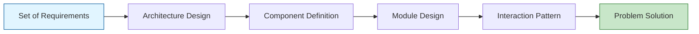

### Core Principles

Every tech product is a system that has been designed. When designing a system, engineers must:

1. **Break Down Problems**: Decompose complex problem statements into solvable sub problems
2. **Define Components**: Decide on key components and their responsibilities
3. **Establish Boundaries**: Clearly define the boundaries of each component
4. **Address Scalability**: Touch upon key challenges in scaling the system
5. **Ensure Reliability**: Make architecture fault-tolerant and available

### System Design Process

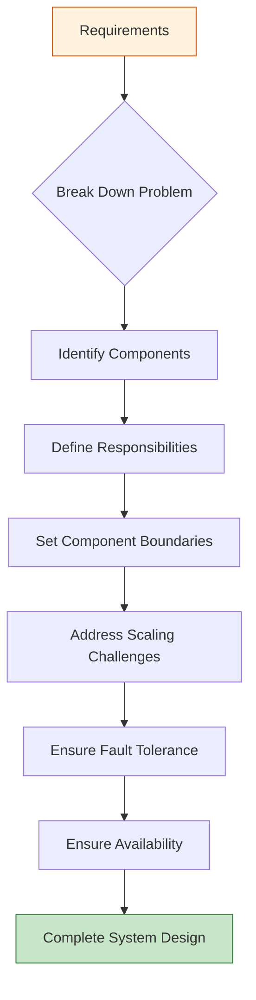

### Key Takeaways

- System Design is the bridge between requirements and implementation
- Every component interaction must be carefully planned
- The process is iterative and practical
- Focus on solving real world problems at scale

---

## 2. Approach to System Design

**Location:** `02-approachSD/approachSD.txt`

### Structured Methodology

System Design is extremely practical and requires a structured approach. The key is to take small, deliberate steps rather than attempting to solve everything at once.

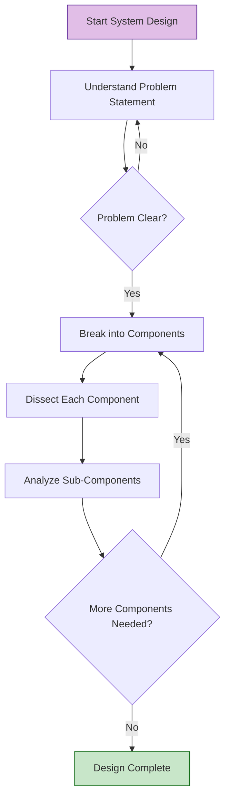

### Step-by-Step Process

#### Step 1: Understand the Problem Statement

Without a thorough understanding of the problem at hand, the design process would easily digress. Invest time in clarifying requirements and constraints.

#### Step 2: Break Down into Components

- Do not create components for the sake of it
- Create only components that are essential
- Start with the must have components

#### Step 3: Dissect Each Component

For each component or sub-component, analyze the following aspects:

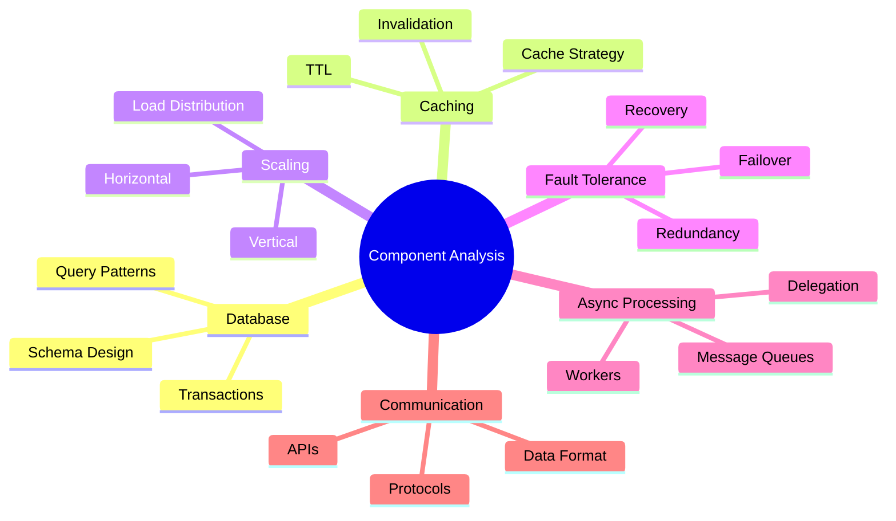

#### Step 4: Iterate

- Repeat the analysis for each sub component one by one
- Add more sub components if needed during the iteration
- Refine the design based on new insights

### Design Checklist

For each component, ensure you cover:

1. **Database and Caching**: Data storage and retrieval strategies
2. **Scaling**: Horizontal and vertical scaling approaches
3. **Fault Tolerance**: Handling failures gracefully
4. **Async Processing**: Delegation and background jobs
5. **Communication**: Inter component communication patterns

---

## 3. Building Good Systems

**Location:** `03-good-system/goodSystem.txt`

### When to Stop Evolving

Every system is "infinitely" buildable, meaning there's always room for improvement. However, knowing when to stop the evolution is crucial for practical delivery.

### Key Indicators of a Good System

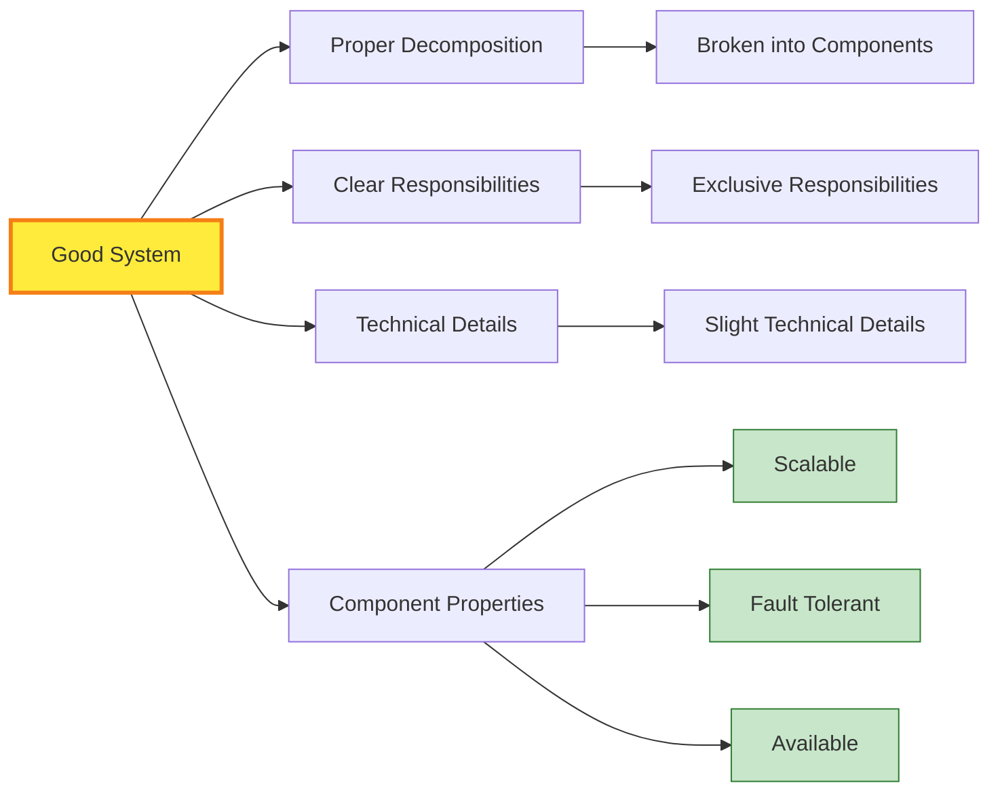

### Four Essential Pointers

#### 1. System Decomposition

The system should be broken down into logical, manageable components. Each component should represent a distinct functional area.

#### 2. Exclusive Responsibilities

Every component must have a clear set of responsibilities that do not overlap with other components. This ensures:
- Clear ownership
- Easier debugging
- Independent development
- Better maintainability

#### 3. Technical Details Figured Out

For each component, slight technical details should be determined, including:
- Technology stack
- Data models
- API contracts
- Communication protocols

#### 4. Component Isolation Properties

Each component, when analyzed in isolation, must be:

**Scalable (Horizontally)**
- Can handle increased load by adding more instances
- Not limited by single-machine constraints

**Fault Tolerant**
- Gracefully handles failures
- Has redundancy mechanisms
- Can recover from errors

**Available**
- High uptime guarantees
- Minimal single points of failure
- Proper failover mechanisms

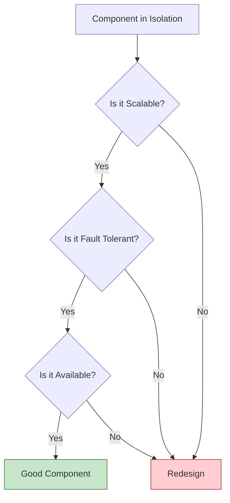

---

## 4. Relational Databases

**Location:** `04-relationDB/relationalDatabases.txt`

### Overview

Databases are the most critical component of any system. They make or break a system. Relational databases store and represent data in rows and columns, providing strong transactional guarantees.

### ACID Properties

Relational databases provide ACID transactions, which are fundamental to data integrity:

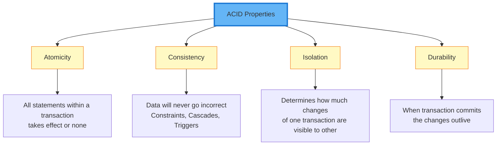

### ACID Explained

#### Atomicity
All statements within a transaction take effect or none. If any part of the transaction fails, the entire transaction is rolled back.

#### Consistency
Data will never go incorrect no matter what. This is enforced through:
- Constraints (Primary keys, Foreign keys, Unique constraints)
- Cascades (ON DELETE CASCADE, ON UPDATE CASCADE)
- Triggers (Automated actions on data changes)

#### Isolation
When multiple transactions are executing in parallel, the isolation level determines how much changes of one transaction are visible to others. Isolation has 4 levels (covered in detail in section 5).

#### Durability
When a transaction commits, the changes outlive system failures. Data is persisted to disk and survives crashes.

### When to Pick Relational Databases

Choose relational databases when you need:
- Strong ACID guarantees
- Complex relationships between entities
- Data integrity and correctness
- Complex queries with joins
- Transactional consistency

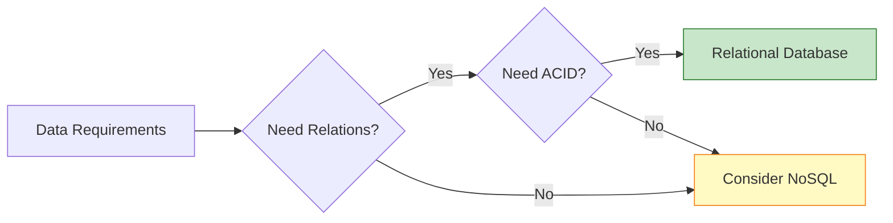

---

## 5. Database Isolation Levels

**Location:** `05-DB_Isolation_levels/isolation_levels.txt`

### Overview

Relational databases provide ACID guarantees and the 'I' in ACID stands for Isolation. Isolation levels help us tune how transactions interact with each other, dictating how much one transaction knows about the other.

### The Four Isolation Levels

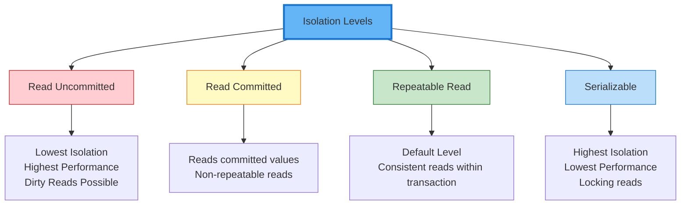

### Detailed Explanation

#### 1. Read Uncommitted
- **Behavior**: Reads even uncommitted values from other transactions
- **Consequence**: "Dirty reads" - reading data that might be rolled back
- **Use Case**: Rarely used due to data integrity risks
- **Performance**: Fastest, no locking overhead

#### 2. Read Committed
- **Behavior**: Reads within the same transaction always read fresh committed values
- **Consequence**: Multiple reads within the same transaction can be inconsistent
- **Use Case**: When you need fresh data on every read
- **Performance**: Good performance with reasonable consistency

#### 3. Repeatable Read (Default)
- **Behavior**: Consistent reads within the same transaction
- **Consequence**: Even if other transactions commit, the first transaction will not see the changes (if value already read)
- **Use Case**: Default for most applications requiring consistency
- **Performance**: Balanced performance and consistency

#### 4. Serializable
- **Behavior**: Every read is a locking read; while one transaction reads, others must wait
- **Consequence**: Complete isolation but significantly slower
- **Use Case**: Critical operations requiring absolute consistency
- **Performance**: Slowest, maximum locking
- **Note**: Implementation depends on the database engine

### Isolation Level Comparison

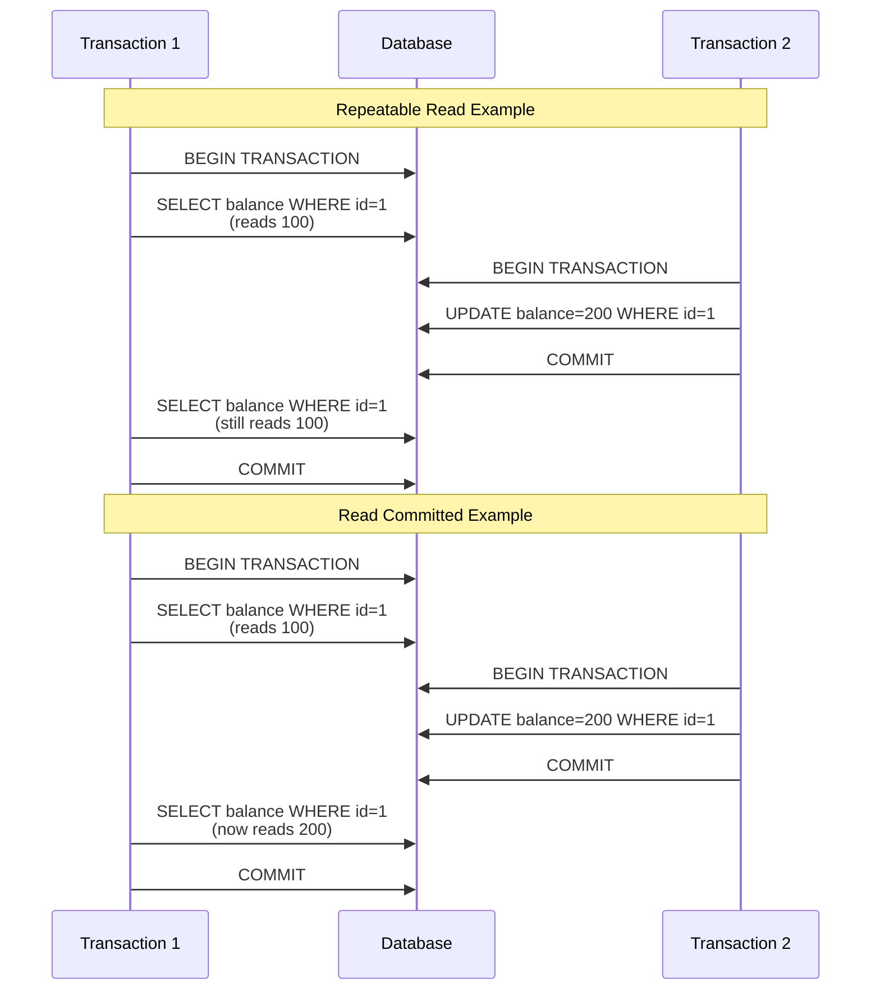

### Choosing the Right Isolation Level

| Isolation Level | Dirty Reads | Non-Repeatable Reads | Phantom Reads | Performance |
|----------------|-------------|---------------------|---------------|-------------|
| Read Uncommitted | Yes | Yes | Yes | Highest |
| Read Committed | No | Yes | Yes | High |
| Repeatable Read | No | No | Yes | Medium |
| Serializable | No | No | No | Lowest |

---

## 6. Scaling Databases

**Location:** `06-scalingDB/scalingDB.txt`

### Overview

Databases are the most important component of any system. They make or break the system. Understanding how to scale databases is critical for building robust, high performance applications. These techniques are applicable to most databases.

### Scaling Strategies

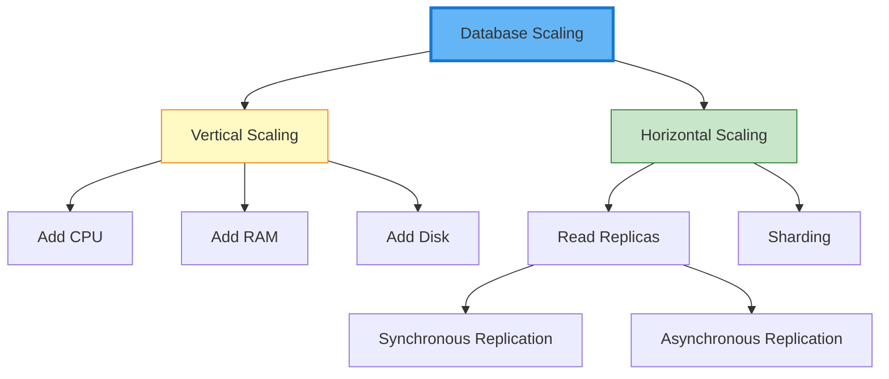

### 1. Vertical Scaling

**Approach**: Add more CPU, RAM and Disk to the database server

**Advantages**:
- Simple to implement
- No code changes required
- Gives ability to handle more load

**Disadvantages**:
- Requires downtime during reboot
- Has physical hardware limitations
- Eventually becomes cost prohibitive
- Single point of failure remains

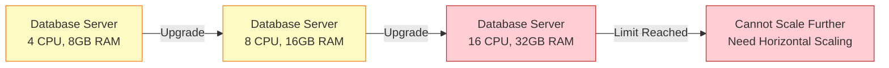

### 2. Horizontal Scaling - Read Replicas

**When to Use**: When read:write ratio is approximately 90:10

**Approach**: 
- Move reads to replica databases
- Keep master database free for writes
- API servers must know which database to connect to

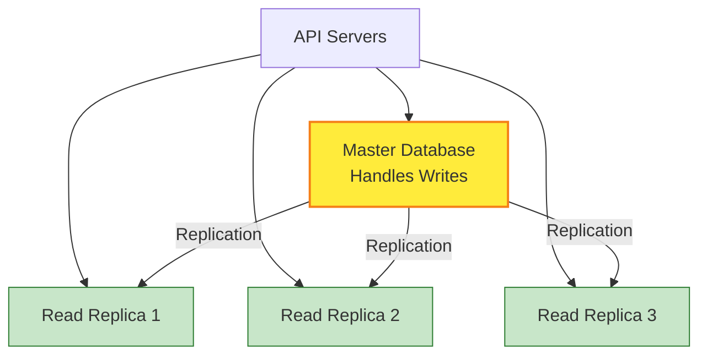

### Replication Modes

#### Synchronous Replication
- **Consistency**: Strong consistency
- **Replication Lag**: Zero replication lag
- **Write Performance**: Slower writes (must wait for replicas)
- **Use Case**: When consistency is critical

#### Asynchronous Replication
- **Consistency**: Weak (eventual) consistency
- **Replication Lag**: Some replication lag exists
- **Write Performance**: Faster writes (no waiting)
- **Use Case**: When performance is prioritized over immediate consistency

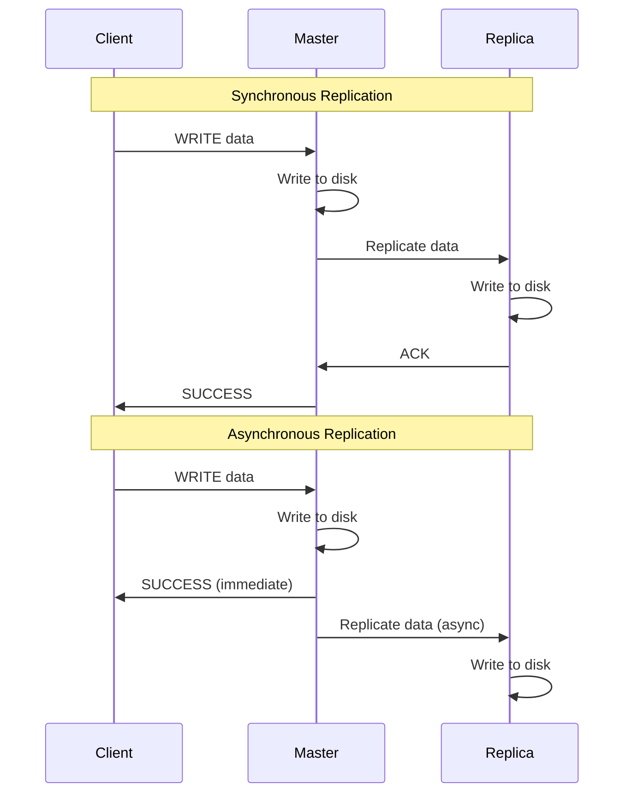

### 3. Horizontal Scaling - Sharding

**When to Use**: When one node cannot handle the data volume or load

**Approach**:
- Split data into multiple exclusive subsets
- Each write on a particular row/document goes to one specific shard
- Shards are independent (no replication between them)
- API server needs to know which shard to connect to

**Note**: Some databases have a proxy that handles routing automatically

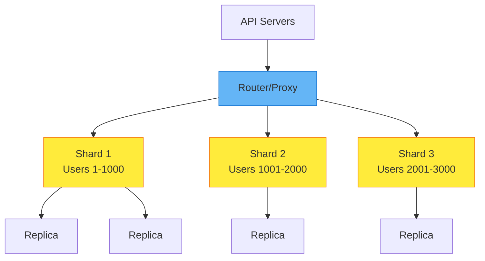

### Scaling Strategy Comparison

| Strategy | Complexity | Cost | Scalability | Downtime | Consistency |
|----------|-----------|------|-------------|----------|-------------|
| Vertical Scaling | Low | High | Limited | Yes | Strong |
| Read Replicas | Medium | Medium | High (reads) | No | Configurable |
| Sharding | High | Medium | Very High | No | Eventually Consistent |

### Best Practices

1. **Start with vertical scaling** for simplicity
2. **Add read replicas** when read-heavy workload increases
3. **Implement sharding** when single node cannot handle the load
4. **Each shard can have its own replicas** for redundancy and read scaling
5. **Monitor replication lag** in asynchronous setups
6. **Plan shard key carefully** to ensure even distribution

---

## 7. Sharding and Partitioning

**Location:** `07-shardingAndPartitioning/sAndp.txt`

### Terminology

**Sharding**: Method of distributing data across multiple machines

**Partitioning**: Splitting a subset of data within the same instance

**Key Distinction**: Overall, a database is sharded while the data is partitioned.

### How Database Scaling Works

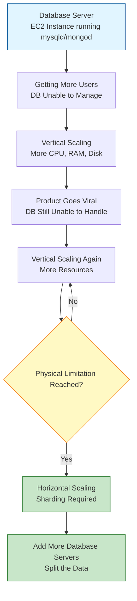

### Practical Example

**Scenario**: 
- One DB server handling 1000 WPS (Writes Per Second)
- Cannot scale vertically beyond this
- Receiving 1500 WPS requests

**Solution**:
By adding one more database server and splitting the data, we reduce the load to 750 WPS on each node, thus handling higher throughput.

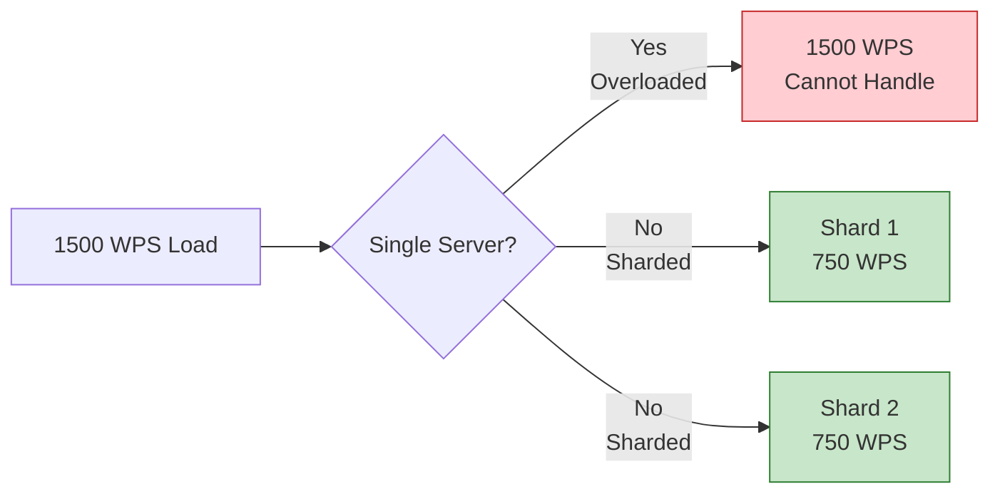

### Data Partitioning Categories

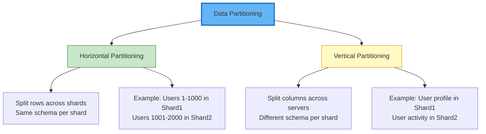

### Horizontal Partitioning Example

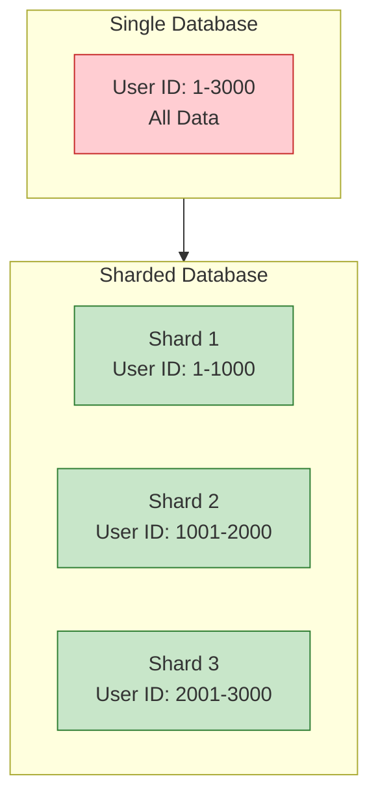

### Advantages of Sharding

1. **Handle Large Reads and Writes**
   - Distribute load across multiple servers
   - Each shard handles a fraction of total traffic

2. **Increase Overall Storage Capacity**
   - Not limited by single machine storage
   - Linear scaling with number of shards

3. **Higher Availability**
   - Failure of one shard doesn't affect others
   - Independent shard operations

```mermaid
graph LR
    A[Sharding Benefits] --> B[Performance]
    A --> C[Capacity]
    A --> D[Availability]
    
    B --> B1[Distributed Load]
    B --> B2[Parallel Processing]
    
    C --> C1[Storage Expansion]
    C --> C2[Linear Scaling]
    
    D --> D1[Isolated Failures]
    D --> D2[Independent Operations]
    
    style A fill:#64b5f6,stroke:#1976d2,stroke-width:3px
```

### Disadvantages of Sharding

1. **Operationally Complex**
   - Requires sophisticated routing logic
   - More infrastructure to manage
   - Backup and restore complexity

2. **Cross-Shard Queries Expensive**
   - Joins across shards are difficult
   - Aggregations require data from multiple shards
   - May need application-level joins

```mermaid
sequenceDiagram
    participant App as Application
    participant S1 as Shard 1
    participant S2 as Shard 2
    participant S3 as Shard 3
    
    Note over App,S3: Cross-Shard Query Problem
    App->>S1: Query data
    App->>S2: Query data
    App->>S3: Query data
    S1->>App: Result 1
    S2->>App: Result 2
    S3->>App: Result 3
    App->>App: Merge and aggregate<br/>(Application layer)
    
    Note over App: Expensive and Complex
```

### Sharding Strategies

```mermaid
graph TD
    A[Sharding Strategies] --> B[Range-Based]
    A --> C[Hash-Based]
    A --> D[Geographic]
    A --> E[Directory-Based]
    
    B --> B1[User ID ranges<br/>1-1000, 1001-2000]
    C --> C1[Hash of key<br/>hash user_id mod N]
    D --> D1[Region-specific<br/>US, EU, ASIA shards]
    E --> E1[Lookup table<br/>Maps key to shard]
    
    style A fill:#64b5f6,stroke:#1976d2,stroke-width:3px
```

### Best Practices

1. **Choose the right shard key**
   - Ensure even distribution
   - Avoid hotspots
   - Consider query patterns

2. **Plan for resharding**
   - Data growth over time
   - Rebalancing requirements
   - Migration strategies

3. **Monitor shard health**
   - Load distribution
   - Storage utilization
   - Query performance

4. **Each shard can have replicas**
   - For read scaling
   - For high availability
   - For disaster recovery

---

## 8. Non-Relational Databases

**Location:** `08-nonRelationDB/nonRelationalDB.txt`

### Overview

Non-relational databases (NoSQL) are a broad category of databases that differ from traditional relational databases (MySQL, PostgreSQL). However, this does not mean all non-relational databases are similar - each type has unique characteristics and use cases.

### Key Advantage

**Most non-relational databases shard out of the box**, providing horizontal scalability without complex manual configuration.

```mermaid
graph LR
    A[Non-Relational DBs] --> B[Built-in Sharding]
    B --> C[Horizontal Scalability]
    C --> D[Easy to Scale]
    C --> E[No Manual Configuration]
    C --> F[Distributed by Default]
    
    style A fill:#64b5f6,stroke:#1976d2,stroke-width:3px
    style C fill:#c8e6c9,stroke:#2e7d32
```

### Three Important Types of NoSQL Databases

```mermaid
graph TD
    A[NoSQL Databases] --> B[Document Databases]
    A --> C[Key-Value Stores]
    A --> D[Graph Databases]
    
    B --> B1[MongoDB]
    B --> B2[Elasticsearch]
    
    C --> C1[Redis]
    C --> C2[DynamoDB]
    C --> C3[Aerospike]
    
    D --> D1[Neo4j]
    D --> D2[Neptune]
    D --> D3[Dgraph]
    
    style A fill:#64b5f6,stroke:#1976d2,stroke-width:3px
    style B fill:#c8e6c9,stroke:#2e7d32
    style C fill:#fff9c4,stroke:#f57f17
    style D fill:#ce93d8,stroke:#7b1fa2
```

---

### 1. Document Databases

**Examples**: MongoDB, Elasticsearch

```mermaid
graph TD
    A[Document Databases] --> B[JSON-Based Storage]
    A --> C[Complex Queries]
    A --> D[Partial Updates]
    A --> E[Closest to Relational DB]
    
    B --> B1[Flexible Schema]
    B --> B2[Nested Documents]
    
    C --> C1[Aggregations]
    C --> C2[Filtering]
    C --> C3[Sorting]
    
    D --> D1[Update specific fields]
    D --> D2[No need to fetch entire doc]
    
    style A fill:#c8e6c9,stroke:#2e7d32,stroke-width:2px
```

#### Characteristics

- **Mostly JSON based**: Store documents in JSON like format
- **Support complex queries**: Almost like relational SQL databases
- **Partial updates possible**: Can update specific fields without fetching entire document
- **Closest to relational DB**: Most similar query capabilities to traditional RDBMS

#### Example Document Structure

```json
{
  "user_id": 12345,
  "name": "John Doe",
  "email": "john@example.com",
  "address": {
    "street": "123 Main St",
    "city": "New York",
    "country": "USA"
  },
  "orders": [
    {"order_id": 1, "total": 99.99},
    {"order_id": 2, "total": 149.99}
  ]
}
```

---

### 2. Key Value Stores

**Examples**: Redis, DynamoDB, Aerospike

```mermaid
graph TD
    A[Key-Value Stores] --> B[Extremely Simple]
    A --> C[Limited Functionalities]
    A --> D[Key-Based Access]
    A --> E[Highly Shardable]
    
    B --> B1[Simple Data Model]
    B --> B2[Fast Operations]
    
    C --> C1[GET key]
    C --> C2[PUT key, value]
    C --> C3[DEL key]
    
    D --> D1[Direct key lookup]
    D --> D2[No complex queries]
    
    E --> E1[Easy partitioning]
    E --> E2[Linear scalability]
    
    style A fill:#fff9c4,stroke:#f57f17,stroke-width:2px
```

#### Characteristics

- **Extremely simple databases**: Minimal complexity
- **Limited functionalities**: Typically only GET, PUT, DEL operations
- **Key-based access pattern**: Direct lookup by key
- **Does not support complex queries**: No aggregations or joins
- **Can be heavily sharded and partitioned**: Excellent horizontal scalability

#### Use Cases

- Profile data storage
- Order data
- Authentication data
- Message storage
- Session management
- Real-time data access

#### Example Operations

```
GET user:12345
PUT user:12345 {"name": "John", "email": "john@example.com"}
DEL user:12345
```

#### Important Note

**You can use relational databases and document DBs as KV stores**, but dedicated KV stores offer better performance and scalability for key-based access patterns.

```mermaid
sequenceDiagram
    participant App as Application
    participant KV as Key-Value Store
    
    App->>KV: GET profile:user123
    KV->>App: {name: "John", email: "..."}
    
    App->>KV: PUT profile:user123 {data}
    KV->>App: OK
    
    App->>KV: DEL profile:user123
    KV->>App: OK
    
    Note over App,KV: Simple, Fast, Efficient
```

---

### 3. Graph Databases

**Examples**: Neo4j, Neptune, Dgraph

```mermaid
graph TD
    A[Graph Databases] --> B[Nodes]
    A --> C[Edges]
    A --> D[Relations]
    
    B --> B1[Entities]
    C --> C1[Connections]
    D --> D1[Properties]
    
    A --> E[Complex Algorithms]
    A --> F[Use Cases]
    
    E --> E1[Shortest Path]
    E --> E2[Community Detection]
    E --> E3[PageRank]
    
    F --> F1[Social Networks]
    F --> F2[Recommendations]
    F --> F3[Fraud Detection]
    
    style A fill:#ce93d8,stroke:#7b1fa2,stroke-width:2px
```

#### Characteristics

- **Graph data structure as database**: Natural representation of connected data
- **Stores data as nodes, edges, and relations**: Explicit relationship modeling
- **Great for complex graph algorithms**: Built in graph traversal and analysis
- **Powerful for specific domains**: Excels where relationships are first  class citizens

#### Use Cases

1. **Social Networks**
   - Friend connections
   - Follow relationships
   - Social graph traversal

2. **Recommendations**
   - Collaborative filtering
   - Product recommendations
   - Content suggestions

3. **Fraud Detection**
   - Transaction patterns
   - Network analysis
   - Anomaly detection

#### Example Graph Structure

```mermaid
graph LR
    A[User: Alice] -->|FOLLOWS| B[User: Bob]
    A -->|LIKES| C[Post: Tech Article]
    B -->|LIKES| C
    B -->|FOLLOWS| D[User: Charlie]
    D -->|WROTE| C
    A -->|FRIEND_OF| D
    
    style A fill:#c8e6c9,stroke:#2e7d32
    style B fill:#c8e6c9,stroke:#2e7d32
    style D fill:#c8e6c9,stroke:#2e7d32
    style C fill:#fff9c4,stroke:#f57f17
```

### NoSQL Database Comparison

| Feature | Document DB | Key-Value Store | Graph DB |
|---------|------------|----------------|----------|
| **Data Model** | JSON documents | Key-value pairs | Nodes & edges |
| **Query Complexity** | High | Low | Medium-High |
| **Scalability** | High | Very High | Medium |
| **Use Case** | General purpose | Simple lookups | Relationship-heavy |
| **Examples** | MongoDB, Elasticsearch | Redis, DynamoDB | Neo4j, Neptune |
| **Schema** | Flexible | None | Semi-structured |
| **Performance** | Good | Excellent | Good for graphs |

### When to Use What

```mermaid
flowchart TD
    A[Data Requirements] --> B{Access Pattern?}
    
    B -->|Complex Queries| C[Document DB]
    B -->|Key-Based Lookup| D[Key-Value Store]
    B -->|Relationship-Heavy| E[Graph DB]
    
    C --> C1[MongoDB<br/>Elasticsearch]
    D --> D1[Redis<br/>DynamoDB]
    E --> E1[Neo4j<br/>Neptune]
    
    style A fill:#64b5f6,stroke:#1976d2
    style C1 fill:#c8e6c9,stroke:#2e7d32
    style D1 fill:#fff9c4,stroke:#f57f17
    style E1 fill:#ce93d8,stroke:#7b1fa2
```

---

## 9. Picking the Right Database

**Location:** `09-pickDB/pickrightDB.txt`

### Overview

Each kind of database targets a specific segment with some overlap. Choosing the right database is crucial for system performance, scalability, and maintainability.

### Common Misconception

**Myth**: "Pick non-relational DB because relational databases do not scale"

**Reality**: Both can scale if designed properly.

```mermaid
graph TD
    A[Why NoSQL Scales Easily?] --> B[No Relations/Constraints]
    A --> C[Data Modeled for Sharding]
    
    D[Can Relational DBs Scale?] --> E[Yes, with adjustments]
    E --> F[Do not use foreign keys]
    E --> G[Do not use cross-shard transactions]
    E --> H[Do manual sharding]
    
    style A fill:#c8e6c9,stroke:#2e7d32
    style D fill:#64b5f6,stroke:#1976d2
    style E fill:#fff9c4,stroke:#f57f17
```

### Database Selection Factors

Every database has peculiar properties and guarantees. If you need specific features, you pick that database.

```mermaid
mindmap
  root((Database Selection))
    Data Characteristics
      Type of data
      Data volume
      Growth rate
    Access Patterns
      Read/Write ratio
      Query complexity
      Latency requirements
    Special Features
      TTL/Expiration
      Full-text search
      Geospatial queries
      ACID guarantees
    Operational
      Team expertise
      Cost
      Maintenance
```

### Selection Process

Before jumping to a particular database, understand:

1. **What data are you storing?**
   - Structure: structured, semi-structured, unstructured
   - Relationships between entities
   - Data types and formats

2. **How much data will you be storing?**
   - Current volume
   - Growth projections
   - Storage requirements

3. **How will you access the data?**
   - Read-heavy or write-heavy
   - Access patterns (key-based, range queries, full scans)
   - Latency requirements

4. **What kind of queries will you fire?**
   - Simple lookups
   - Complex joins
   - Aggregations
   - Full-text search

5. **Any special features you expect?**
   - TTL (Time To Live) / Expiration
   - Transactions
   - Consistency guarantees
   - Built-in caching

---

### Decision Tree: Data Fits on Single Node

```mermaid
flowchart TD
    A[Data Fits on Single Node] --> B{Strong Consistency<br/>& Correctness Important?}
    
    B -->|Yes| C[Relational Database]
    B -->|No| D{Need Complex Queries<br/>& Aggregations?}
    
    C --> C1[MySQL, PostgreSQL<br/>Use Case: Payment transactions]
    
    D -->|Yes| E[Document Database]
    D -->|No| F{KV Access<br/>Need Speed?}
    
    E --> E1[MongoDB, Elasticsearch]
    
    F -->|Yes| G[Redis]
    F -->|No| H{Need Advanced<br/>Data Structures?}
    
    G --> G1[Redis<br/>Fast KV operations]
    H -->|Yes| I[Redis<br/>Sets, Lists, Sorted Sets]
    
    style C fill:#c8e6c9,stroke:#2e7d32
    style E fill:#c8e6c9,stroke:#2e7d32
    style G fill:#fff9c4,stroke:#f57f17
    style I fill:#fff9c4,stroke:#f57f17
```

#### Scenario 1: Strong Consistency & Data Correctness Important

**Choose**: Relational Databases (MySQL, PostgreSQL)

**Example**: Payment transactions, financial data, order management

**Rationale**: ACID guarantees ensure data integrity

---

#### Scenario 2: Need Complex Queries & Aggregations

**Choose**: Non-Relational Databases (MongoDB, Elasticsearch)

**Example**: Analytics, search functionality, flexible schema

**Rationale**: Powerful query capabilities without rigid schema

---

#### Scenario 3: Key-Value Access, Need Speed

**Choose**: Redis

**Example**: Session management, rate limiting, real-time data

**Rationale**: In-memory performance, microsecond latency

---

#### Scenario 4: Need Advanced Data Structures & Algorithms

**Choose**: Redis

**Example**: Leaderboards, pub-sub systems, real-time analytics

**Rationale**: Built-in support for sets, sorted sets, lists, etc.

---

### Decision Tree: Data Cannot Fit on One Node

```mermaid
flowchart TD
    A[Data Cannot Fit on One Node] --> B{Expertise in SQL<br/>& Manual Sharding?}
    
    B -->|Yes| C[Relational Database<br/>Manual Sharding]
    B -->|No| D{Access Pattern?}
    
    C --> C1[MySQL, PostgreSQL<br/>Drop constraints<br/>Manual sharding]
    
    D -->|Simple KV| E[Key-Value Store]
    D -->|Complex Queries| F[Document Database]
    D -->|Graph Operations| G[Graph Database]
    D -->|Nothing Specific| F
    
    E --> E1[DynamoDB, MongoDB<br/>KV mode]
    F --> F1[MongoDB<br/>Default choice]
    G --> G1[Neo4j, Neptune]
    
    style C1 fill:#64b5f6,stroke:#1976d2
    style E1 fill:#fff9c4,stroke:#f57f17
    style F1 fill:#c8e6c9,stroke:#2e7d32
    style G1 fill:#ce93d8,stroke:#7b1fa2
```

#### Scenario 1: SQL Expertise & Can Do Manual Sharding

**Choose**: Relational Database with Manual Sharding

**Approach**:
- Drop foreign key constraints
- Avoid cross-shard transactions
- Implement application-level sharding logic

**Example**: Large-scale applications with SQL expertise

---

#### Scenario 2: Simple Key-Value Based Access

**Choose**: Key-Value Store (DynamoDB, MongoDB in KV mode)

**Example**: User profiles, session data, configuration

**Rationale**: Auto-sharding, simple operations, high scalability

---

#### Scenario 3: Require Sophisticated Graph Algorithms

**Choose**: Graph Database (Neo4j, Neptune)

**Example**: Social networks, fraud detection, recommendation engines

**Rationale**: Optimized for relationship queries and graph traversal

---

#### Scenario 4: Nothing Specific

**Choose**: Document Database (MongoDB)

**Example**: General-purpose applications, MVP development

**Rationale**: Flexible, scalable, good balance of features

---

### Complete Database Selection Matrix

| Requirement | Data Fits Single Node | Data Needs Sharding |
|-------------|----------------------|---------------------|
| **Strong Consistency** | Relational DB (MySQL, PostgreSQL) | Relational DB + Manual Sharding |
| **Complex Queries** | Document DB (MongoDB, Elasticsearch) | Document DB (MongoDB) |
| **Simple KV Access** | Redis | DynamoDB, Aerospike |
| **Speed Critical** | Redis (in-memory) | Redis Cluster |
| **Graph Operations** | Neo4j | Neo4j Cluster |
| **Advanced Data Structures** | Redis | Redis Cluster |
| **General Purpose** | PostgreSQL | MongoDB |

### Practical Examples

```mermaid
graph TD
    A[Real-World Examples] --> B[E-commerce Platform]
    A --> C[Social Media]
    A --> D[Banking System]
    A --> E[Analytics Platform]
    
    B --> B1[Orders: Relational DB]
    B --> B2[Product Catalog: Document DB]
    B --> B3[Session: Redis]
    
    C --> C1[User Profiles: Document DB]
    C --> C2[Connections: Graph DB]
    C --> C3[Feed Cache: Redis]
    
    D --> D1[Transactions: Relational DB]
    D --> D2[Fraud Detection: Graph DB]
    D --> D3[Auth Tokens: Redis]
    
    E --> E1[Raw Events: Document DB]
    E --> E2[Aggregations: Elasticsearch]
    E --> E3[Real-time: Redis]
    
    style A fill:#64b5f6,stroke:#1976d2,stroke-width:3px
```

### Key Takeaways

1. **No single database fits all use cases** - most systems use multiple databases
2. **Understand your requirements first** before selecting a database
3. **Consider scalability from the start** but don't over-engineer
4. **Team expertise matters** - choose what your team can maintain
5. **Start simple, scale later** - vertical scaling is often enough initially
6. **Test at scale** - benchmark with realistic data volumes
7. **Document DB is safe default** - when in doubt, MongoDB is a reasonable choice

```mermaid
flowchart LR
    A[Start Here] --> B{Understand Requirements}
    B --> C{Evaluate Options}
    C --> D{Consider Trade-offs}
    D --> E{Make Decision}
    E --> F{Test & Validate}
    F --> G[Deploy]
    
    style A fill:#e1f5ff,stroke:#01579b
    style G fill:#c8e6c9,stroke:#2e7d32
```

---

## 10. Caching Fundamentals

**Location:** `10-caching/caching.txt`

### What is Caching?

Caches are anything that helps you avoid an expensive network I/O, disk I/O, or computation. They store frequently accessed data in a temporary storage location that's faster to access than the primary data source.

```mermaid
graph LR
    A[Expensive Operations] --> B[Network I/O]
    A --> C[Disk I/O]
    A --> D[Heavy Computation]
    
    B --> E[API calls]
    C --> F[Database queries]
    D --> G[Complex joins]
    
    E --> H[Cache]
    F --> H
    G --> H
    
    H --> I[Fast Access]
    
    style A fill:#ffcdd2,stroke:#c62828
    style H fill:#c8e6c9,stroke:#2e7d32
    style I fill:#c8e6c9,stroke:#2e7d32
```

### Examples of Expensive Operations

1. **API call to get profile information** - Network latency
2. **Reading a specific line from a file** - Disk I/O
3. **Doing multiple table joins** - CPU-intensive computation

### How Caching Works

```mermaid
sequenceDiagram
    participant User
    participant API
    participant Cache
    participant Database
    
    User->>API: Request data
    API->>Cache: Check cache
    
    alt Data in Cache
        Cache->>API: Return cached data
        API->>User: Fast response
    else Cache Miss
        Cache->>API: Not found
        API->>Database: Query database
        Database->>API: Return data
        API->>Cache: Store in cache
        API->>User: Response (slower)
    end
    
    Note over Cache: Faster & Expensive
    Note over Database: Slower & Cheaper
```

### Key Principles

1. **Cache is checked first** - Always try cache before expensive operation
2. **Caches are faster and expensive** - Typically in-memory (RAM)
3. **Partial data caching** - Only cache subset of data most likely to be accessed
4. **Not restricted to RAM** - Any nearer storage that avoids expensive operations

```mermaid
graph TD
    A[Caching Principles] --> B[Subset of Data]
    A --> C[Frequently Accessed]
    A --> D[Temporary Storage]
    A --> E[Fast Access]
    
    B --> B1[Not all data cached]
    B --> B2[Hot data only]
    
    C --> C1[Access patterns matter]
    C --> C2[Recency important]
    
    D --> D1[With expiration]
    D --> D2[Can be invalidated]
    
    E --> E1[Lower latency]
    E --> E2[Reduced load]
    
    style A fill:#64b5f6,stroke:#1976d2,stroke-width:3px
```

### Common Cache Technologies

- **Redis**: In-memory data store, supports rich data structures
- **Memcached**: Simple in-memory key-value cache
- **CDN**: Content delivery network for static assets
- **Browser Cache**: Client-side caching

### Simplest Form

In the simplest form, caches are just glorified hash tables.

```
cache = {
  "user:123": {name: "John", email: "john@example.com"},
  "post:456": {title: "System Design", content: "..."},
  "session:abc": {user_id: 123, expires: 1234567890}
}
```

---

### Real-World Examples

#### Example 1: Google News

```mermaid
graph TD
    A[Google News] --> B[Recent Articles]
    B --> C[More Likely to be Accessed]
    C --> D[Served from Cache]
    
    A --> E[Older Articles]
    E --> F[Less Likely to be Accessed]
    F --> G[Served from Database]
    
    style D fill:#c8e6c9,stroke:#2e7d32
    style G fill:#fff9c4,stroke:#f57f17
```

**Scenario**: Most recent news articles are more likely to be accessed

**Solution**: Cache recent articles (last 24-48 hours)

**Benefit**: Reduced database load, faster response times

---

#### Example 2: Authentication Tokens

```mermaid
sequenceDiagram
    participant User
    participant API
    participant Cache
    participant AuthDB
    
    Note over User,AuthDB: Every Request Checks Token
    
    User->>API: Request with token
    API->>Cache: Verify token
    
    alt Token Valid in Cache
        Cache->>API: Valid (0.5ms)
        API->>User: Process request
    else Token Not in Cache
        API->>AuthDB: Verify token
        AuthDB->>API: Valid (50ms)
        API->>Cache: Store token
        API->>User: Process request
    end
    
    Note over Cache: 100x faster than DB
```

**Scenario**: Authentication tokens are checked on every request

**Solution**: Cache valid tokens in Redis

**Benefit**: Avoid database hit on every request, microsecond latency

---

#### Example 3: Live Stream

```mermaid
graph LR
    A[Live Stream] --> B[Last 10 Minutes]
    B --> C[Most Accessed]
    C --> D[Cached on CDN]
    
    A --> E[Older Content]
    E --> F[Less Accessed]
    F --> G[Served from Origin]
    
    style D fill:#c8e6c9,stroke:#2e7d32
    style G fill:#fff9c4,stroke:#f57f17
```

**Scenario**: Last 10 minutes of live stream accessed most frequently

**Solution**: Cache recent content on CDN edge servers

**Benefit**: Lower latency, reduced origin server load

---

### Cache Performance Impact

```mermaid
graph TD
    A[Without Cache] --> B[Every Request to DB]
    B --> C[High Latency: 50-100ms]
    B --> D[High DB Load]
    B --> E[Limited Throughput]
    
    F[With Cache] --> G[Most Requests to Cache]
    G --> H[Low Latency: 0.5-5ms]
    G --> I[Low DB Load]
    G --> J[High Throughput]
    
    style A fill:#ffcdd2,stroke:#c62828
    style F fill:#c8e6c9,stroke:#2e7d32
```

### When to Use Caching

```mermaid
flowchart TD
    A[Consider Caching When] --> B{Read-Heavy Workload?}
    A --> C{Expensive Operations?}
    A --> D{Repeated Requests?}
    A --> E{Acceptable Staleness?}
    
    B -->|Yes| F[Good Candidate]
    C -->|Yes| F
    D -->|Yes| F
    E -->|Yes| F
    
    B -->|No| G[Maybe Not]
    C -->|No| G
    D -->|No| G
    E -->|No| G
    
    style F fill:#c8e6c9,stroke:#2e7d32
    style G fill:#ffcdd2,stroke:#c62828
```

### Key Takeaways

1. **Cache to avoid expensive operations** - Network, disk, computation
2. **Cache frequently accessed data** - Use access patterns to determine what to cache
3. **Caches are temporary** - Data has expiration (TTL)
4. **Not just RAM** - Any nearer storage can act as cache
5. **Subset of data** - Don't cache everything, only hot data
6. **Significant performance boost** - 10-100x improvement possible

---

## 11. Populating Cache

**Location:** `11-populateCache/populateCache.txt`

### Overview

Cache sits between the API server and the database. Whenever we set something in cache, we set an expiration (TTL - Time To Live) to ensure data doesn't become stale indefinitely.

```mermaid
graph LR
    A[API Server] <--> B[Cache Layer]
    B <--> C[Database]
    
    style B fill:#fff9c4,stroke:#f57f17,stroke-width:2px
```

### Two Ways to Populate Cache

```mermaid
graph TD
    A[Cache Population Strategies] --> B[Lazy Population]
    A --> C[Eager Population]
    
    B --> B1[Cache on Read]
    B --> B2[Most Popular]
    B --> B3[On-Demand]
    
    C --> C1[Cache on Write]
    C --> C2[Proactive]
    C --> C3[Anticipate Need]
    
    style A fill:#64b5f6,stroke:#1976d2,stroke-width:3px
    style B fill:#c8e6c9,stroke:#2e7d32
    style C fill:#fff9c4,stroke:#f57f17
```

---

### 1. Lazy Population (Cache-Aside Pattern)

**Most popular approach** - Populate cache on-demand when data is first requested.

#### Algorithm

```
function getData(key):
    data = cache.get(key)
    
    if data exists:
        return data  // Cache Hit
    else:
        // Cache Miss
        data = database.query(key)
        cache.set(key, data, TTL)
        return data
```

#### Flow Diagram

```mermaid
sequenceDiagram
    participant Client
    participant API
    participant Cache
    participant DB
    
    Note over Client,DB: First Request (Cache Miss)
    Client->>API: GET /blog/123
    API->>Cache: GET blog:123
    Cache->>API: NULL (miss)
    API->>DB: SELECT * FROM blogs WHERE id=123
    DB->>API: Blog data
    API->>Cache: SET blog:123, data, TTL=3600
    Cache->>API: OK
    API->>Client: Blog data (slow: ~50ms)
    
    Note over Client,DB: Subsequent Requests (Cache Hit)
    Client->>API: GET /blog/123
    API->>Cache: GET blog:123
    Cache->>API: Blog data (hit)
    API->>Client: Blog data (fast: ~1ms)
```

#### Example: Caching Blog Posts

**Scenario**: Fetching a blog from database is expensive (multiple joins for author, tags, comments)

**Solution**:
1. When someone accesses a blog, fetch from database
2. Cache the result in Redis with TTL
3. Subsequent requests are served from cache

```mermaid
graph TD
    A[User Requests Blog] --> B{In Cache?}
    B -->|Yes| C[Return from Cache<br/>1ms response]
    B -->|No| D[Fetch from DB<br/>Complex joins]
    D --> E[Store in Cache<br/>TTL: 1 hour]
    E --> F[Return to User<br/>50ms response]
    
    style C fill:#c8e6c9,stroke:#2e7d32
    style D fill:#ffcdd2,stroke:#c62828
```

#### Advantages
- Simple to implement
- Only caches data that's actually accessed
- No wasted cache space

#### Disadvantages
- First request is always slow (cache miss)
- Cache stampede possible for popular items

---

### 2. Eager Population

Populate cache proactively before data is requested. Two approaches:

#### Approach 1: Write-Through Cache

**Write to both database and cache simultaneously**

```mermaid
sequenceDiagram
    participant Client
    participant API
    participant Cache
    participant DB
    
    Client->>API: UPDATE data
    
    par Write to both
        API->>DB: UPDATE database
        API->>Cache: SET cache
    end
    
    DB->>API: OK
    Cache->>API: OK
    API->>Client: Success
    
    Note over API: Both updated atomically
```

#### Example: Live Cricket Score

**Scenario**: Thousands of people are watching cricket scores in real-time

**Solution**:
- When score updates, write to both database and cache
- Saves cache miss since data will definitely be accessed
- Users always get instant response

```mermaid
graph LR
    A[Score Update] --> B[Write to DB]
    A --> C[Write to Cache]
    
    D[1000s of Users] --> C
    C --> E[Instant Response<br/>No Cache Miss]
    
    style C fill:#c8e6c9,stroke:#2e7d32
    style E fill:#c8e6c9,stroke:#2e7d32
```

**Benefits**:
- No cache miss for hot data
- Consistent performance
- Always fresh data in cache

---

#### Approach 2: Proactive Push to Cache

**Anticipate need and push data to cache in advance**

```mermaid
sequenceDiagram
    participant Event
    participant Service
    participant Cache
    participant Users
    
    Note over Event,Users: Celebrity Posts Content
    
    Event->>Service: New post by celebrity
    Service->>Service: Detect high-profile user<br/>(100k+ followers)
    Service->>Cache: Proactively cache post
    Cache->>Service: OK
    
    Note over Users: Followers access post
    Users->>Cache: GET post (cache hit)
    Cache->>Users: Instant response
    
    Note over Event,Users: Regular User Posts
    
    Event->>Service: New post by regular user
    Service->>Service: Normal flow<br/>(lazy population)
```

#### Example: Celebrity Tweet/Post

**Scenario**: When an account with 100k+ followers posts something, it will be accessed frequently

**Solution**:
1. Detect high-profile account posting
2. Proactively push content to cache
3. Followers get instant access without cache miss

```mermaid
graph TD
    A[Celebrity Posts] --> B{Follower Count > 100k?}
    B -->|Yes| C[Proactively Cache]
    B -->|No| D[Normal Lazy Caching]
    
    C --> E[Push to Cache Immediately]
    E --> F[All Followers Get<br/>Cache Hit]
    
    D --> G[First Access Misses]
    G --> H[Then Cached]
    
    style C fill:#c8e6c9,stroke:#2e7d32
    style F fill:#c8e6c9,stroke:#2e7d32
```

**Benefits**:
- Eliminate cache miss for viral content
- Better user experience
- Reduced database load during traffic spikes

---

### Comparison: Lazy vs Eager Population

| Aspect | Lazy Population | Eager Population |
|--------|----------------|------------------|
| **When Cached** | On first read | On write or anticipation |
| **Cache Miss** | First request always misses | No miss for anticipated data |
| **Complexity** | Simple | More complex |
| **Cache Efficiency** | High (only accessed data) | Can cache unused data |
| **Use Case** | General purpose | Hot data, real-time updates |
| **Performance** | Good after first request | Consistently excellent |
| **Resource Usage** | Efficient | Can be wasteful |

### Combined Strategy

```mermaid
flowchart TD
    A[Data Update] --> B{Is Data Hot?}
    
    B -->|Yes<br/>Viral/Popular| C[Eager Population]
    B -->|No<br/>Regular| D[Lazy Population]
    
    C --> C1[Write-Through Cache]
    C --> C2[Proactive Push]
    
    D --> D1[Cache on Read]
    
    style C fill:#fff9c4,stroke:#f57f17
    style D fill:#c8e6c9,stroke:#2e7d32
```

**Best Practice**: Use a combination of both strategies
- Lazy population for most data (default)
- Eager population for known hot data
- Monitor access patterns to identify hot data

---

### Scaling Cache

Cache is just like a database, hence scaling techniques for cache (like Redis) are similar to scaling a database.

```mermaid
graph TD
    A[Cache Scaling] --> B[Vertical Scaling]
    A --> C[Horizontal Scaling - Replicas]
    A --> D[Horizontal Scaling - Sharding]
    
    B --> B1[Make cache bigger<br/>Handle more data/load]
    
    C --> C1[Same data replicated<br/>across multiple nodes]
    C --> C2[Scale reads]
    
    D --> D1[Data partitioned<br/>across shards]
    D --> D2[Scale writes]
    D --> D3[Each shard can have replicas]
    
    style A fill:#64b5f6,stroke:#1976d2,stroke-width:3px
    style B fill:#fff9c4,stroke:#f57f17
    style C fill:#c8e6c9,stroke:#2e7d32
    style D fill:#c8e6c9,stroke:#2e7d32
```

#### Vertical Scaling
Make your cache bigger to handle more data and load
- Increase RAM
- More CPU cores
- Limited by hardware

#### Horizontal Scaling - Replica
Same data replicated across multiple nodes so that reads can scale
- Read distribution
- High availability
- Eventual consistency

#### Horizontal Scaling - Sharding
Data partitioned across multiple shards so that writes can scale
- Each shard handles subset of keys
- Linear scalability
- Each shard can have its own replicas
- Shards are mutually exclusive (no data overlap)

```mermaid
graph TD
    A[Cache Cluster] --> B[Shard 1<br/>Keys: A-H]
    A --> C[Shard 2<br/>Keys: I-P]
    A --> D[Shard 3<br/>Keys: Q-Z]
    
    B --> B1[Replica 1]
    B --> B2[Replica 2]
    
    C --> C1[Replica 1]
    
    D --> D1[Replica 1]
    D --> D2[Replica 2]
    
    style A fill:#64b5f6,stroke:#1976d2
    style B fill:#fff9c4,stroke:#f57f17
    style C fill:#fff9c4,stroke:#f57f17
    style D fill:#fff9c4,stroke:#f57f17
```

---

## 12. Caching at Different Levels

**Location:** `12-cachingDifferentLevels/cachingLevels.txt`

### Overview

Redis is the most common cache, but it's not the only type of cache or the only place where caching can be implemented. Literally every component in the infrastructure can be used as a cache.

### Should We Cache Everywhere?

**It depends on the guarantees** - Too much caching can lead to:
- Stale data problems
- Complex invalidation logic
- Debugging difficulties
- Consistency issues

```mermaid
graph TD
    A[Caching Considerations] --> B[Guarantees Needed]
    A --> C[Staleness Tolerance]
    A --> D[Invalidation Complexity]
    
    B --> B1[Consistency]
    B --> B2[Freshness]
    
    C --> C1[How stale is acceptable?]
    C --> C2[Impact of stale data]
    
    D --> D1[How to invalidate?]
    D --> D2[Cascade invalidation]
    
    style A fill:#64b5f6,stroke:#1976d2,stroke-width:3px
```

---

### Multi-Level Caching Architecture

```mermaid
graph TD
    A[User] --> B[Client-Side Cache<br/>Browser/Mobile]
    B --> C[CDN Cache<br/>Edge Servers]
    C --> D[Load Balancer Cache<br/>Session Data]
    D --> E[Remote Cache<br/>Redis/Memcached]
    E --> F[Database Cache<br/>Query Cache]
    F --> G[Database<br/>Source of Truth]
    
    style B fill:#e1f5ff,stroke:#01579b
    style C fill:#fff9c4,stroke:#f57f17
    style D fill:#f3e5f5,stroke:#7b1fa2
    style E fill:#c8e6c9,stroke:#2e7d32
    style F fill:#ffe0b2,stroke:#e65100
    style G fill:#ffcdd2,stroke:#c62828
```

---

### 1. Client-Side Caching

Store frequently accessed data on the client side (browser, mobile devices).

```mermaid
graph TD
    A[Client-Side Caching] --> B[Browser Cache]
    A --> C[Mobile App Cache]
    A --> D[LocalStorage/SessionStorage]
    
    B --> B1[Static Assets]
    B --> B2[API Responses]
    
    C --> C1[User Data]
    C --> C2[Offline Support]
    
    D --> D1[Preferences]
    D --> D2[Temporary Data]
    
    style A fill:#e1f5ff,stroke:#01579b,stroke-width:2px
```

#### What to Cache

- **Near-constant data**: Images, CSS, JavaScript files
- **User information**: Profile data, preferences
- **Static content**: Configuration, translations

#### Characteristics

- **Massive performance boost** - No network request needed
- **It should be okay serving stale data** - Accept some staleness
- **Invalidation by time (expiry)** - Use TTL or version numbers
- **Reduces backend load** - Fewer requests to server

#### Example: HTTP Cache Headers

```http
Cache-Control: public, max-age=86400
ETag: "abc123"
Last-Modified: Mon, 01 Jan 2024 00:00:00 GMT
```

```mermaid
sequenceDiagram
    participant Browser
    participant CDN
    participant Server
    
    Note over Browser,Server: First Request
    Browser->>CDN: GET /logo.png
    CDN->>Server: GET /logo.png
    Server->>CDN: logo.png + Cache-Control: max-age=86400
    CDN->>Browser: logo.png + headers
    Browser->>Browser: Cache for 24 hours
    
    Note over Browser,Server: Subsequent Requests (within 24 hours)
    Browser->>Browser: Serve from cache
    
    Note over Browser: No network request!
```

---

### 2. CDN (Content Delivery Network)

CDNs are a set of servers distributed across the world. Requests from users go to the nearest CDN server, providing very quick responses.

```mermaid
graph TD
    A[Global CDN Network] --> B[US East]
    A --> C[US West]
    A --> D[Europe]
    A --> E[Asia]
    A --> F[Australia]
    
    B --> B1[New York]
    B --> B2[Miami]
    
    C --> C1[San Francisco]
    C --> C2[Seattle]
    
    D --> D1[London]
    D --> D2[Frankfurt]
    
    E --> E1[Singapore]
    E --> E2[Tokyo]
    
    F --> F1[Sydney]
    
    style A fill:#64b5f6,stroke:#1976d2,stroke-width:3px
```

#### Use Cases

- **Live streaming** - Video content
- **Static assets** - Images, videos, audio
- **JavaScript bundles** - Application code
- **API responses** - Cacheable endpoints

#### How CDN Caching Works

**CDN uses lazy cache population (Cache-Aside Pattern)**

```mermaid
sequenceDiagram
    participant User
    participant CDN
    participant Origin
    
    Note over User,Origin: First Request to CDN (Cache Miss)
    User->>CDN: GET /image.jpg
    CDN->>CDN: Check cache
    CDN->>Origin: Forward request to origin
    Origin->>CDN: image.jpg + TTL
    CDN->>CDN: Cache response
    CDN->>User: image.jpg (slow: ~200ms)
    
    Note over User,Origin: Subsequent Requests (Cache Hit)
    User->>CDN: GET /image.jpg
    CDN->>CDN: Found in cache
    CDN->>User: image.jpg (fast: ~20ms)
    
    Note over CDN: 10x faster!
```

#### CDN Workflow

```
1. User request comes to CDN ? closest server
2. CDN server checks if it has the data
3. If YES: return the data (Cache Hit)
4. If NO:
   a. CDN makes same request to origin server
   b. Gets the response
   c. Caches the response with TTL
   d. Returns the data
```

#### Geographic Performance

```mermaid
graph LR
    A[US User] --> B[US CDN Server]
    B --> C[20ms response]
    
    D[India User] --> E[India CDN Server]
    E --> F[25ms response]
    
    G[Without CDN<br/>India User] --> H[US Origin Server]
    H --> I[300ms response]
    
    style C fill:#c8e6c9,stroke:#2e7d32
    style F fill:#c8e6c9,stroke:#2e7d32
    style I fill:#ffcdd2,stroke:#c62828
```

**Key Point**: US users getting images from US servers is faster than fetching from India

#### CDN Expiration

Like any other cache, when we put data on CDN, we set an expiry to it. Post expiry, CDN deletes the data.

```mermaid
graph TD
    A[Data Added to CDN] --> B[Set TTL: 24 hours]
    B --> C{Time Elapsed?}
    C -->|< 24 hours| D[Serve from Cache]
    C -->|= 24 hours| E[Delete from Cache]
    E --> F[Next Request = Cache Miss]
    F --> G[Fetch from Origin]
    G --> B
    
    style D fill:#c8e6c9,stroke:#2e7d32
    style E fill:#fff9c4,stroke:#f57f17
```

---

### 3. Remote Cache (Redis)

Remote cache is a centralized cache that multiple API servers use to store frequently accessed data.

```mermaid
graph TD
    A[API Server 1] --> D[Redis Cluster]
    B[API Server 2] --> D
    C[API Server 3] --> D
    
    D --> E[Shard 1]
    D --> F[Shard 2]
    D --> G[Shard 3]
    
    E --> E1[Replica]
    F --> F1[Replica]
    G --> G1[Replica]
    
    style D fill:#c8e6c9,stroke:#2e7d32,stroke-width:2px
```

#### Characteristics

- **Centralized and shared** - Multiple services access same cache
- **In-memory storage** - Extremely fast (microsecond latency)
- **Expensive** - RAM is costly compared to disk
- **Requires expiration** - Every key must have TTL to manage memory
- **Relatively small size** - Limited by available RAM

#### What to Cache in Redis

```mermaid
mindmap
  root((Redis Cache))
    Session Data
      User sessions
      Auth tokens
      Shopping cart
    Hot Data
      Recent posts
      Trending items
      Popular products
    Computed Data
      Aggregations
      Leaderboards
      Counters
    Temporary Data
      OTP codes
      Rate limits
      Locks
```

#### Best Practices

1. **Always set TTL** - Prevent memory exhaustion
2. **Cache hot data** - Frequently accessed items
3. **Monitor memory** - Set eviction policies
4. **Use appropriate data structures** - Strings, Lists, Sets, Sorted Sets

```
SET user:123:session "data" EX 3600     # Expires in 1 hour
SET otp:phone:9999 "123456" EX 300      # Expires in 5 minutes
ZADD leaderboard 1500 "player1"         # Sorted set for rankings
```

---

### 4. Database Caching

Caching computed or aggregated data within the database itself to avoid expensive recomputation.

```mermaid
graph TD
    A[Database Caching] --> B[Computed Columns]
    A --> C[Materialized Views]
    A --> D[Query Cache]
    
    B --> B1[Denormalization]
    B --> B2[Aggregated Data]
    
    C --> C1[Precomputed Joins]
    C --> C2[Complex Queries]
    
    D --> D1[Query Results]
    D --> D2[Execution Plans]
    
    style A fill:#ffe0b2,stroke:#e65100,stroke-width:2px
```

#### Example: Caching Total Posts

Instead of computing total posts by a user every time with an expensive query:

```sql
-- Expensive Query (Every Time)
SELECT COUNT(*) FROM posts WHERE user_id = 123;
```

Store 	otal_posts as a column in the users table and update it periodically:

```sql
-- Fast Query
SELECT total_posts FROM users WHERE user_id = 123;

-- Update once in a while (async job or trigger)
UPDATE users SET total_posts = total_posts + 1 WHERE user_id = 123;
```

#### Benefits

- **Avoid expensive computations** - Precompute and store
- **Faster queries** - Direct column access
- **Reduced CPU usage** - Less query processing

#### Trade-offs

- **Potential staleness** - Data might be slightly outdated
- **Storage overhead** - Extra columns/tables
- **Sync complexity** - Keep cached data updated

```mermaid
sequenceDiagram
    participant App
    participant DB
    
    Note over App,DB: Without Caching
    App->>DB: SELECT COUNT(*) FROM posts WHERE user_id=123
    DB->>DB: Scan posts table (slow)
    DB->>App: 1,234 (50ms)
    
    Note over App,DB: With Caching
    App->>DB: SELECT total_posts FROM users WHERE id=123
    DB->>DB: Index lookup (fast)
    DB->>App: 1,234 (2ms)
```

---

### 5. Load Balancer Caching

Load balancers can cache session information and other data.

```mermaid
graph TD
    A[Users] --> B[Load Balancer]
    B --> C[Session Cache]
    B --> D[Server 1]
    B --> E[Server 2]
    B --> F[Server 3]
    
    C --> C1[Sticky Sessions]
    C --> C2[Session Affinity]
    
    style B fill:#f3e5f5,stroke:#7b1fa2,stroke-width:2px
```

#### Use Cases

- **Session affinity** - Route user to same server
- **SSL session caching** - Reuse SSL handshakes
- **Rate limiting** - Track request counts

---

### Caching Strategy Comparison

| Cache Level | Latency | Capacity | Staleness Risk | Use Case |
|-------------|---------|----------|----------------|----------|
| **Client-Side** | ~0ms | Small | High | Static assets, UI state |
| **CDN** | ~20ms | Large | Medium | Media files, static content |
| **Load Balancer** | ~1ms | Small | Low | Sessions, SSL |
| **Remote (Redis)** | ~1ms | Medium | Low | Hot data, sessions |
| **Database** | ~5ms | Large | Medium | Computed aggregations |

---

### Cache Invalidation Strategies

```mermaid
graph TD
    A[Cache Invalidation] --> B[Time-Based - TTL]
    A --> C[Event-Based]
    A --> D[Manual]
    
    B --> B1[Set expiration time]
    B --> B2[Auto cleanup]
    
    C --> C1[On data update]
    C --> C2[Publish/Subscribe]
    
    D --> D1[Admin action]
    D --> D2[Deployment]
    
    style A fill:#64b5f6,stroke:#1976d2,stroke-width:3px
```

#### Time-Based (TTL)
```
cache.set("key", "value", ttl=3600)  # Expires after 1 hour
```

#### Event-Based
```
on_user_update(user_id):
    cache.delete(f"user:{user_id}")
    cache.delete(f"user:{user_id}:profile")
```

#### Manual Invalidation
```
cache.flush_all()  # Clear entire cache
cache.delete_pattern("user:*")  # Pattern-based deletion
```

---

### Best Practices for Multi-Level Caching

```mermaid
flowchart TD
    A[Caching Best Practices] --> B[Set Appropriate TTLs]
    A --> C[Monitor Cache Hit Rates]
    A --> D[Plan Invalidation Strategy]
    A --> E[Avoid Over-Caching]
    A --> F[Consider Consistency]
    
    B --> B1[Short TTL for dynamic data]
    B --> B2[Long TTL for static data]
    
    C --> C1[Track hit/miss ratios]
    C --> C2[Optimize cache size]
    
    D --> D1[Event-driven invalidation]
    D --> D2[Graceful degradation]
    
    E --> E1[Cache only hot data]
    E --> E2[Avoid cache bloat]
    
    F --> F1[Accept eventual consistency]
    F --> F2[Strong consistency where needed]
    
    style A fill:#64b5f6,stroke:#1976d2,stroke-width:3px
```

### Key Principles

1. **Cache at the right level** - Choose based on access patterns
2. **Set appropriate TTLs** - Balance freshness and performance
3. **Monitor cache effectiveness** - Track hit rates and memory usage
4. **Plan invalidation** - Don't let stale data accumulate
5. **Accept trade-offs** - Performance vs. consistency
6. **Avoid over-caching** - Too much caching is bad
7. **Use case specific** - Subject to tolerance level of staleness

---

### When NOT to Cache

```mermaid
graph TD
    A[Avoid Caching When] --> B[Strong Consistency Required]
    A --> C[Frequently Changing Data]
    A --> D[Personalized Data]
    A --> E[Security-Sensitive Data]
    
    B --> B1[Financial transactions]
    B --> B2[Inventory counts]
    
    C --> C1[Real-time updates]
    C --> C2[Live data feeds]
    
    D --> D1[User-specific content]
    D --> D2[Low cache hit rate]
    
    E --> E1[Passwords]
    E --> E2[PII]
    
    style A fill:#ffcdd2,stroke:#c62828,stroke-width:2px
```

---

### Summary

Caching can be implemented at multiple levels of the infrastructure stack. Each level has its own characteristics, advantages, and trade-offs. The key is to:

- Understand what data to cache at each level
- Set appropriate TTLs based on data characteristics
- Implement proper invalidation strategies
- Monitor cache effectiveness
- Accept that some staleness is often acceptable for massive performance gains

**Remember**: Not every component should cache everything. It is very use case specific and subject to the tolerance level of staleness of the served data.

---

## 16. Load Balancers

Load balancers are critical components in distributed systems that enable horizontal scalability by distributing incoming traffic across multiple servers. They act as the single point of contact for clients, hiding the complexity of multiple backend servers.

### Core Concept

```mermaid
graph LR
    A[Clients] --> B[Load Balancer<br/>Static IP/DNS]
    B --> C[Server 1]
    B --> D[Server 2]
    B --> E[Server 3]
    B --> F[Server N]
    
    style B fill:#fff9c4,stroke:#f57f17
    style C fill:#c8e6c9,stroke:#2e7d32
    style D fill:#c8e6c9,stroke:#2e7d32
    style E fill:#c8e6c9,stroke:#2e7d32
    style F fill:#c8e6c9,stroke:#2e7d32
```

Every load balancer has either:
1. **Static IP address**
2. **Static DNS name** (e.g., `auth.example.com`)

This allows clients to communicate without knowing about individual backend servers.

### Request-Response Flow

```mermaid
sequenceDiagram
    participant Client
    participant LB as Load Balancer
    participant S1 as Server 1
    participant S2 as Server 2
    
    Client->>LB: GET auth.example.com/login
    Note over LB: Select server using algorithm
    LB->>S1: Forward request
    S1->>LB: Response
    LB->>Client: Return response
    
    Client->>LB: GET auth.example.com/profile
    Note over LB: Select different server
    LB->>S2: Forward request
    S2->>LB: Response
    LB->>Client: Return response
```

**Steps**:
1. Client has the IP/domain of the load balancer
2. Client makes API call to load balancer
3. Load balancer picks a server using configured algorithm
4. Load balancer forwards the request to selected server
5. Server processes and returns response to load balancer
6. Load balancer returns response to client

### Load Balancing Algorithms

#### 1. Round Robin
Distribute requests iteratively across all servers in sequence.

```
Request 1 -> Server 1
Request 2 -> Server 2
Request 3 -> Server 3
Request 4 -> Server 1 (cycle repeats)
```

**Best for**: Servers with similar capacity and requests with similar processing time.

#### 2. Weighted Round Robin
Distribute requests iteratively but according to assigned weights.

```
Server 1 (weight: 3) -> Receives 3 requests
Server 2 (weight: 2) -> Receives 2 requests
Server 3 (weight: 1) -> Receives 1 request
```

**Best for**: Servers with different capacities.

#### 3. Least Connections
Select the server with the fewest active connections.

```mermaid
graph TD
    A[New Request] --> B{Check Connections}
    B --> C[Server 1: 10 conn]
    B --> D[Server 2: 5 conn]
    B --> E[Server 3: 8 conn]
    
    D -.->|Selected| F[Route to Server 2]
    
    style D fill:#c8e6c9,stroke:#2e7d32
    style F fill:#c8e6c9,stroke:#2e7d32
```

**Best for**: Requests with high variance in response time.

#### 4. Hash-Based Routing
Use a hash function on request attributes to determine server selection.

Common hash attributes:
- Client IP address
- User ID
- URL path

```
hash(user_id) % num_servers = server_index
```

**Benefits**:
- Same user/client always routes to same server
- Enables sticky sessions
- Useful for caching at server level

**Best for**: Session affinity requirements or server-side caching.

### Key Advantages

```mermaid
graph TD
    A[Load Balancer Benefits] --> B[Scalability]
    A --> C[Availability]
    A --> D[Flexibility]
    
    B --> B1[Add more servers<br/>behind LB]
    B --> B2[Handle more requests<br/>without client changes]
    
    C --> C1[Server crashes don't<br/>take down system]
    C --> C2[Route to healthy<br/>servers only]
    
    D --> D1[Update servers without<br/>downtime]
    D --> D2[Rolling deployments]
    
    style A fill:#64b5f6,stroke:#1976d2
    style B fill:#c8e6c9,stroke:#2e7d32
    style C fill:#fff9c4,stroke:#f57f17
    style D fill:#ce93d8,stroke:#7b1fa2
```

#### 1. Scalability
- Add servers behind the load balancer transparently
- Handle increasing traffic by scaling horizontally
- Clients remain unaware of infrastructure changes

#### 2. Availability
- If one server crashes, system continues functioning
- Load balancer routes traffic only to healthy servers
- Performs health checks on backend servers
- Improves overall system reliability

#### 3. Transparency
- Clients don't need to know about individual servers
- Infrastructure changes invisible to users
- Simplifies client implementation

### Health Checks

Load balancers continuously monitor server health:

```mermaid
sequenceDiagram
    participant LB as Load Balancer
    participant S1 as Server 1 (Healthy)
    participant S2 as Server 2 (Failed)
    participant S3 as Server 3 (Healthy)
    
    loop Every 10 seconds
        LB->>S1: Health check
        S1-->>LB: OK 200
        
        LB->>S2: Health check
        S2--xLB: Timeout/Error
        
        LB->>S3: Health check
        S3-->>LB: OK 200
    end
    
    Note over LB: Route traffic only to S1 and S3
```

### Real-World Example

**Without Load Balancer**:
```
Client -> Server IP: 192.168.1.100
(If server fails, entire system down)
```

**With Load Balancer**:
```
Client -> LB: api.example.com
LB -> Server 1: 192.168.1.100
LB -> Server 2: 192.168.1.101
LB -> Server 3: 192.168.1.102
(If one server fails, traffic routes to others)
```

### Summary

Load balancers are essential for:
- **Horizontal scalability**: Add servers as needed
- **High availability**: System survives server failures
- **Performance**: Distribute load efficiently
- **Maintenance**: Update servers without downtime

They hide infrastructure complexity from clients while providing flexibility to scale and maintain systems.

---

## 17. Circuit Breakers

Circuit breakers are protective mechanisms that prevent cascading failures in distributed systems. They detect when a service is unhealthy and stop making calls to it, preventing the failure from spreading throughout the system.

### The Problem: Cascading Failures

Consider a social network serving user feeds:

```mermaid
graph TD
    A[Feed Service] --> B[Recommendation Service]
    A --> C[Trending Service]
    
    B --> D[Profile Service]
    B --> E[Post Service]
    
    C --> D
    C --> E
    
    F[Other Services] --> D
    G[Other Services] --> D
    H[Other Services] --> D
    
    style D fill:#ffcdd2,stroke:#c62828
    style B fill:#fff9c4,stroke:#f57f17
    style C fill:#fff9c4,stroke:#f57f17
    style A fill:#fff9c4,stroke:#f57f17
```

**Scenario**:
1. User requests their feed from Feed Service
2. Feed Service pulls data from Recommendation and Trending services
3. Both Recommendation and Trending depend on Profile Service (for user details)
4. Both also depend on Post Service (for post content)
5. Many other services throughout the system depend on Profile Service

**What happens when Profile Service's database is overwhelmed?**

```mermaid
sequenceDiagram
    participant User
    participant Feed
    participant Recommend
    participant Profile as Profile Service<br/>(SLOW/DOWN)
    
    User->>Feed: Get my feed
    Feed->>Recommend: Get recommendations
    Recommend->>Profile: Get user profiles
    
    Note over Profile: Database overwhelmed<br/>Responses very slow or timeout
    
    Profile--xRecommend: Timeout (30s)
    Note over Recommend: Waiting, blocking threads
    
    Recommend--xFeed: Timeout (30s)
    Note over Feed: Waiting, blocking threads
    
    Feed--xUser: Error/Timeout
    Note over User: Bad experience
```

**Consequences**:
1. **Complete outage** - Service becomes unresponsive
2. **Cascading failures** - All dependent services slow down or fail
3. **Resource exhaustion** - Threads/connections blocked waiting for slow service
4. **System-wide impact** - Entire product can collapse

### The Solution: Circuit Breaker Pattern

Break the circuit when detecting failures to prevent cascade.

```mermaid
stateDiagram-v2
    [*] --> Closed: Initial State
    
    Closed --> Open: Failure threshold exceeded
    Open --> HalfOpen: Timeout period elapsed
    HalfOpen --> Closed: Success
    HalfOpen --> Open: Failure
    
    note right of Closed
        Normal operation
        Requests pass through
    end note
    
    note right of Open
        Circuit broken
        Fail fast, no requests
    end note
    
    note right of HalfOpen
        Testing recovery
        Limited requests
    end note
```

### Circuit States

#### 1. Closed (Normal Operation)
```mermaid
graph LR
    A[Service A] -->|Request| B[Circuit Breaker<br/>CLOSED]
    B -->|Forward| C[Service B]
    C -->|Response| B
    B -->|Return| A
    
    style B fill:#c8e6c9,stroke:#2e7d32
```

- All requests pass through normally
- Monitor for failures
- Track success/failure rate

#### 2. Open (Circuit Broken)
```mermaid
graph LR
    A[Service A] -->|Request| B[Circuit Breaker<br/>OPEN]
    B -.->|Blocked| C[Service B<br/>UNHEALTHY]
    B -->|Immediate Error| A
    
    style B fill:#ffcdd2,stroke:#c62828
    style C fill:#ffcdd2,stroke:#c62828
```

- Requests immediately fail without calling the service
- Fast failure prevents resource exhaustion
- Wait for timeout period before testing again

#### 3. Half-Open (Testing)
```mermaid
graph LR
    A[Service A] -->|Limited Requests| B[Circuit Breaker<br/>HALF-OPEN]
    B -->|Test Request| C[Service B<br/>Recovering?]
    C -->|Success/Failure| B
    
    style B fill:#fff9c4,stroke:#f57f17
```

- Allow limited requests to test service health
- If successful: transition to Closed
- If failed: transition back to Open

### Implementation

```mermaid
graph TD
    A[Circuit Breaker Config DB] --> B[Service 1]
    A --> C[Service 2]
    A --> D[Service 3]
    A --> E[Service N]
    
    B --> F[Cache Config<br/>Locally]
    C --> F
    D --> F
    E --> F
    
    style A fill:#64b5f6,stroke:#1976d2
    style F fill:#c8e6c9,stroke:#2e7d32
```

**Configuration Storage**:
- Common database holds settings for each circuit breaker
- Services check configuration before making calls
- Configurations are cached to avoid database overhead

**Configuration Examples**:
```json
{
  "profile-service": {
    "status": "open",
    "failure_threshold": 50,
    "timeout": 60,
    "half_open_requests": 5
  },
  "post-service": {
    "status": "closed",
    "failure_threshold": 50,
    "timeout": 60
  }
}
```

### With Circuit Breaker: Preventing Cascade

```mermaid
sequenceDiagram
    participant User
    participant Feed
    participant CB as Circuit Breaker
    participant Recommend
    participant Profile as Profile Service<br/>(UNHEALTHY)
    
    Note over CB: Profile Service marked<br/>as UNHEALTHY
    
    User->>Feed: Get my feed
    Feed->>CB: Check Profile Service status
    CB-->>Feed: Circuit OPEN - Don't call
    
    Feed->>Recommend: Get recommendations<br/>(without profile data)
    Recommend->>CB: Check Profile Service status
    CB-->>Recommend: Circuit OPEN - Don't call
    
    Recommend-->>Feed: Response (degraded, no profiles)
    Feed-->>User: Feed (without profile details)
    
    Note over User: Degraded but functional<br/>experience
```

**Benefits**:
- System continues functioning with degraded features
- No cascading timeouts
- Resources not blocked waiting
- Unhealthy service gets time to recover

### Real-World Example: Social Network Feed

**Without Circuit Breaker**:
```
Profile Service down
  -> Recommendation Service slow/timeout
  -> Trending Service slow/timeout
  -> Feed Service slow/timeout
  -> User gets error
  -> ENTIRE FEATURE DOWN
```

**With Circuit Breaker**:
```
Profile Service down
  -> Circuit breaker opens
  -> Services skip profile calls
  -> Feed shows posts without profile details
  -> User gets degraded but functional feed
  -> FEATURE WORKS (with limitations)
```

### Configuration Parameters

| Parameter | Description | Typical Value |
|-----------|-------------|---------------|
| **Failure Threshold** | Number/percentage of failures before opening | 50% or 10 consecutive |
| **Timeout Period** | How long circuit stays open | 30-60 seconds |
| **Success Threshold** | Successes needed in half-open to close | 3-5 requests |
| **Request Volume** | Minimum requests before evaluation | 10-20 requests |
| **Half-Open Requests** | Number of test requests in half-open | 1-5 requests |

### Monitoring and Alerts

```mermaid
graph TD
    A[Circuit Breaker Events] --> B[Opened]
    A --> C[Half-Opened]
    A --> D[Closed]
    
    B --> E[Alert Team]
    B --> F[Log Event]
    B --> G[Update Dashboard]
    
    C --> H[Monitor Closely]
    
    D --> I[Service Recovered]
    
    style B fill:#ffcdd2,stroke:#c62828
    style C fill:#fff9c4,stroke:#f57f17
    style D fill:#c8e6c9,stroke:#2e7d32
```

**Key metrics to track**:
- Circuit state changes
- Failure rates
- Response times
- Number of blocked requests
- Time in open state

### Best Practices

1. **Set appropriate thresholds** - Too sensitive causes unnecessary breaks, too lenient allows cascades
2. **Implement fallback strategies** - Return cached data, default values, or degraded functionality
3. **Monitor actively** - Circuit opens indicate serious problems requiring attention
4. **Test regularly** - Ensure circuit breakers trigger correctly under failure conditions
5. **Coordinate with retries** - Circuit breakers work well with retry logic but avoid retry storms

### Summary

Circuit breakers prevent cascading failures by:
- **Detecting unhealthy services** through failure monitoring
- **Breaking the circuit** to stop calls to failing services
- **Failing fast** instead of blocking resources
- **Testing recovery** before fully restoring traffic
- **Protecting system integrity** and maintaining partial functionality

They are essential for building resilient distributed systems that gracefully degrade instead of completely failing.

---

## 18. Data Redundancy and Recovery

Data redundancy is critical for protecting against data loss in distributed systems. Unlike stateless API servers that can be easily replaced, databases are stateful components where failure can be catastrophic.

### The Fundamental Problem

```mermaid
graph TD
    A[System Components] --> B[API Servers<br/>STATELESS]
    A --> C[Databases<br/>STATEFUL]
    
    B --> D[Easy to Replace]
    B --> E[Spin up instantly]
    B --> F[No data loss]
    
    C --> G[Catastrophic if lost]
    C --> H[Data loss risk]
    C --> I[Outage impact]
    
    style B fill:#c8e6c9,stroke:#2e7d32
    style C fill:#ffcdd2,stroke:#c62828
```

**API Servers**:
- Stateless - no persistent data
- Going down is manageable
- New server spins up almost instantly
- Any server can handle any request

**Databases**:
- Stateful - contain critical data
- Going down is catastrophic
- Disk crash can mean permanent data loss
- Outages directly impact users

### The Solution: Data Redundancy

The only way to protect against data loss is to create multiple copies of data.

```mermaid
graph TD
    A[Data Redundancy Strategies] --> B[Backup and Restore]
    A --> C[Continuous Redundancy]
    
    B --> B1[Periodic Backups]
    B --> B2[Easy to Implement]
    B --> B3[Some Data Loss Risk]
    
    C --> C1[Real-time Replication]
    C --> C2[More Complex]
    C --> C3[Minimal Data Loss]
    
    style A fill:#64b5f6,stroke:#1976d2
    style B fill:#fff9c4,stroke:#f57f17
    style C fill:#c8e6c9,stroke:#2e7d32
```

### Redundancy Implementation Levels

Redundancy can be implemented at different granularities:

| Level | Description | Example |
|-------|-------------|---------|
| **Row/Document** | Individual records replicated | Critical user records |
| **Table** | Entire tables replicated | User authentication table |
| **Database** | Complete database replicated | Full database copy |

Redundant data can be stored:
- **Different table** in same database
- **Different database** on same server
- **Different server** in same region
- **Different region** for disaster recovery

### Approach 1: Backup and Restore

Traditional approach using periodic backups.

```mermaid
graph LR
    A[Primary Database] -->|Daily Incremental| B[Backup Storage]
    A -->|Weekly Full| C[Full Backup]
    C -->|Cross Region| D[Disaster Recovery<br/>Storage]
    
    style A fill:#64b5f6,stroke:#1976d2
    style B fill:#fff9c4,stroke:#f57f17
    style C fill:#c8e6c9,stroke:#2e7d32
    style D fill:#ce93d8,stroke:#7b1fa2
```

**Backup Strategy**:

1. **Incremental Backups** (Daily)
   - Only backup changes since last backup
   - Fast and efficient
   - Smaller storage requirements

2. **Full Backups** (Weekly)
   - Complete database snapshot
   - Slower but comprehensive
   - Simplifies restoration

3. **Cross-Region Backups** (Disaster Recovery)
   - Store copies in different geographic regions
   - Protect against regional disasters
   - Ensures business continuity

**Recovery Process**:

```mermaid
sequenceDiagram
    participant Ops as Operations Team
    participant Backup as Backup Storage
    participant DB as Primary Database
    
    Note over DB: DISASTER: Disk failure
    
    Ops->>Backup: Request latest backup
    Backup-->>Ops: Return backup files
    Ops->>DB: Restore from backup
    
    Note over DB: System back online<br/>(with some data loss)
```

**Advantages**:
- Almost always the easiest to implement
- Well-understood process
- Cost-effective for most use cases
- Works with existing infrastructure

**Disadvantages**:
- **Data loss window**: Lose all changes since last backup
- **Recovery time**: Can take hours to restore large databases
- **Downtime**: System unavailable during restoration

**Use Cases**:
- Non-critical systems with acceptable data loss window
- Batch processing systems
- Analytics databases
- Systems with off-peak hours for backups

### Approach 2: Continuous Redundancy (Replication)

Real-time or near-real-time data replication to standby databases.

```mermaid
graph LR
    A[API Server] --> B[Primary Database]
    B -->|Replicate| C[Replica Database]
    B -->|Replicate| D[Replica Database]
    
    style B fill:#64b5f6,stroke:#1976d2
    style C fill:#c8e6c9,stroke:#2e7d32
    style D fill:#c8e6c9,stroke:#2e7d32
```

#### Replication Methods

**Method 1: Application-Level Replication**

```mermaid
sequenceDiagram
    participant Client
    participant API
    participant DB1 as Primary DB
    participant DB2 as Replica DB
    
    Client->>API: Write request
    API->>DB1: Write data
    API->>DB2: Write same data
    DB1-->>API: Success
    DB2-->>API: Success
    API-->>Client: Write complete
```

API server writes to both databases simultaneously.

**Advantages**:
- Full control over replication logic
- Can implement custom strategies

**Disadvantages**:
- Application complexity
- Must handle partial failures
- Performance overhead

**Method 2: Database-Level Replication**

```mermaid
sequenceDiagram
    participant Client
    participant API
    participant DB1 as Primary DB
    participant DB2 as Replica DB
    
    Client->>API: Write request
    API->>DB1: Write data
    DB1-->>API: Success
    API-->>Client: Write complete
    
    Note over DB1,DB2: Asynchronous replication
    DB1->>DB2: Replicate changes
```

Primary database handles replication automatically.

**Advantages**:
- Simpler application code
- Optimized by database system
- Standard feature in most databases

**Disadvantages**:
- Less control over replication
- Depends on database capabilities

#### Synchronous vs Asynchronous Replication

**Synchronous Replication**:

```mermaid
sequenceDiagram
    participant API
    participant Primary
    participant Replica
    
    API->>Primary: Write data
    Primary->>Replica: Sync write
    Replica-->>Primary: ACK
    Primary-->>API: Success
    
    Note over Primary,Replica: Data guaranteed<br/>to be on both
```

- Write completes only after replica confirms
- **Zero data loss** if primary fails
- **Higher latency** due to network round-trip
- **Strong consistency** guarantees

**Asynchronous Replication**:

```mermaid
sequenceDiagram
    participant API
    participant Primary
    participant Replica
    
    API->>Primary: Write data
    Primary-->>API: Success (immediate)
    
    Note over Primary,Replica: Later...
    Primary->>Replica: Replicate changes
```

- Write completes immediately on primary
- **Potential data loss** if primary fails before replication
- **Lower latency** for writes
- **Eventual consistency**

### Failover: Promoting Replica to Primary

When primary database fails, replica takes over.

```mermaid
sequenceDiagram
    participant API
    participant Primary as Primary DB<br/>(FAILED)
    participant Replica as Replica DB
    participant Ops as Orchestration
    
    API->>Primary: Write request
    Primary--xAPI: Timeout/Error
    
    API->>Ops: Primary health check failed
    Ops->>Replica: Promote to Primary
    
    Note over Replica: Now accepting writes
    
    API->>Replica: Write request
    Replica-->>API: Success
```

**Failover Process**:
1. Detect primary failure (health checks)
2. Promote replica to primary role
3. Update connection strings/DNS
4. Resume operations with minimal downtime

**Recovery Time**:
- **Backup/Restore**: Hours
- **Continuous Redundancy**: Minutes or seconds (almost instant)

### Standby vs Active Replicas

**Standby Replica**:
```mermaid
graph LR
    A[API Servers] -->|Write & Read| B[Primary DB]
    B -->|Replicate| C[Standby Replica<br/>NO TRAFFIC]
    
    style B fill:#64b5f6,stroke:#1976d2
    style C fill:#fff9c4,stroke:#f57f17
```

- Does not serve production traffic
- Only used during failover
- Simpler setup

**Active Replica (Read Replica)**:
```mermaid
graph LR
    A[API Servers] -->|Write| B[Primary DB]
    A -->|Read| C[Replica DB]
    A -->|Read| D[Replica DB]
    
    B -->|Replicate| C
    B -->|Replicate| D
    
    style B fill:#64b5f6,stroke:#1976d2
    style C fill:#c8e6c9,stroke:#2e7d32
    style D fill:#c8e6c9,stroke:#2e7d32
```

- Serves read traffic
- Reduces load on primary
- Provides both redundancy and scalability

### Hybrid Approach

Many systems use both strategies:

```mermaid
graph TD
    A[Primary Database] -->|Real-time| B[Hot Standby<br/>Replica]
    A -->|Daily| C[Incremental<br/>Backup]
    A -->|Weekly| D[Full Backup]
    D -->|Copy| E[Off-site<br/>Storage]
    
    style A fill:#64b5f6,stroke:#1976d2
    style B fill:#c8e6c9,stroke:#2e7d32
    style C fill:#fff9c4,stroke:#f57f17
    style D fill:#fff9c4,stroke:#f57f17
    style E fill:#ce93d8,stroke:#7b1fa2
```

**Benefits**:
- Replication for quick recovery from crashes
- Backups for protection against data corruption
- Off-site storage for disaster recovery

### Best Practices

1. **Multiple Layers** - Use both replication and backups
2. **Test Recovery** - Regularly practice restore procedures
3. **Monitor Replication Lag** - Ensure replicas stay current
4. **Geographic Distribution** - Place replicas in different regions
5. **Automate Failover** - Reduce recovery time with automation
6. **Backup Verification** - Ensure backups are valid and complete

### Summary

Data redundancy protects against catastrophic data loss through:

| Strategy | Recovery Time | Data Loss | Complexity | Cost |
|----------|--------------|-----------|------------|------|
| **Backup/Restore** | Hours | Last backup period | Low | Low |
| **Async Replication** | Minutes | Seconds | Medium | Medium |
| **Sync Replication** | Seconds | None | High | High |

**Key Principle**: A good system always takes care of catastrophic situations through proper data redundancy and recovery mechanisms.

---

## 19. Leader Election for Auto Recovery

Leader election enables distributed systems to automatically recover from failures without human intervention. It ensures that critical orchestration and monitoring tasks continue even when individual components fail.

### The Auto Recovery Challenge

Consider a system with multiple servers behind a load balancer:

```mermaid
graph TD
    A[Clients] --> B[Load Balancer]
    B --> C[Server 1]
    B --> D[Server 2]
    B --> E[Server 3]
    B --> F[Server N]
    
    G[Orchestrator] -.->|Monitors| C
    G -.->|Monitors| D
    G -.->|Monitors| E
    G -.->|Monitors| F
    
    style B fill:#fff9c4,stroke:#f57f17
    style C fill:#c8e6c9,stroke:#2e7d32
    style D fill:#c8e6c9,stroke:#2e7d32
    style E fill:#c8e6c9,stroke:#2e7d32
    style F fill:#c8e6c9,stroke:#2e7d32
    style G fill:#64b5f6,stroke:#1976d2
```

**Orchestrator Responsibilities**:
- Monitor server health
- Detect failures
- Spin up replacement servers
- Remove unhealthy servers from load balancer

**The Critical Question**: What if the orchestrator itself goes down? Who monitors the monitor?

### The Problem with Single Orchestrator

```mermaid
sequenceDiagram
    participant S as Servers
    participant O as Orchestrator<br/>(SINGLE POINT OF FAILURE)
    participant LB as Load Balancer
    
    Note over O: Orchestrator crashes
    
    S->>S: Server 3 crashes
    Note over S,LB: No one detects failure
    Note over S,LB: No replacement spun up
    Note over S,LB: System degraded
    
    LB->>S: Routes to crashed server
    S--xLB: Timeout/Error
```

**Result**: Manual intervention required, increased downtime, human dependency.

### Solution: Leader-Follower Setup

Run orchestrator in a leader-follower configuration with multiple nodes.

```mermaid
graph TD
    A[Orchestrator Leader] --> B[Backend Servers]
    
    C[Orchestrator Worker 1] -.->|Monitors| B
    D[Orchestrator Worker 2] -.->|Monitors| B
    E[Orchestrator Worker 3] -.->|Monitors| B
    
    A -.->|Monitors| C
    A -.->|Monitors| D
    A -.->|Monitors| E
    
    C -.->|Monitors| A
    D -.->|Monitors| A
    E -.->|Monitors| A
    
    style A fill:#64b5f6,stroke:#1976d2
    style C fill:#c8e6c9,stroke:#2e7d32
    style D fill:#c8e6c9,stroke:#2e7d32
    style E fill:#c8e6c9,stroke:#2e7d32
```

**Roles**:
- **Leader**: Monitors workers, coordinates activities
- **Workers/Followers**: Monitor backend servers, ping leader

**Architecture Benefits**:
- Multiple orchestrator nodes
- One acts as leader
- Others act as workers/followers
- All run the same code

### How It Works

```mermaid
sequenceDiagram
    participant BS as Backend Server
    participant W as Orchestrator Worker
    participant L as Orchestrator Leader
    
    loop Health Checks
        W->>BS: Ping server
        BS-->>W: Healthy
        
        W->>L: I'm alive
        L-->>W: ACK
    end
    
    BS--xW: Server unhealthy
    W->>L: Backend server down
    L->>L: Spin up new backend server
```

**Normal Operation**:
1. Workers ping backend servers to check health
2. Workers ping leader to confirm they're alive
3. Leader monitors workers
4. If worker finds unhealthy backend server, it spins up a new one
5. If leader finds unhealthy worker, it spins up a new one

### Leader Failure and Election

```mermaid
sequenceDiagram
    participant W1 as Worker 1
    participant W2 as Worker 2
    participant W3 as Worker 3
    participant L as Leader<br/>(FAILED)
    
    W1->>L: Heartbeat
    L--xW1: No response
    
    W2->>L: Heartbeat
    L--xW2: No response
    
    W3->>L: Heartbeat
    L--xW3: No response
    
    Note over W1,W3: Leader is dead!
    
    W1->>W1: Trigger leader election
    W2->>W2: Trigger leader election
    W3->>W3: Trigger leader election
    
    Note over W1,W3: Election process
    
    W2->>W1: I am the new leader
    W2->>W3: I am the new leader
    
    Note over W2: Worker 2 becomes Leader
    
    W1->>W2: ACK new leader
    W3->>W2: ACK new leader
```

**What happens when leader dies?**
1. Workers detect leader is unresponsive (no heartbeat)
2. Workers trigger leader election
3. Election algorithm runs
4. New leader is chosen
5. System auto-recovers with minimal downtime

**No human intervention required!**

### Leader Election Algorithms

The choice of leader depends on the election algorithm used.

#### Common Algorithms

**1. Bully Algorithm**
- Node with highest ID becomes leader
- Aggressive takeover approach
- Simple but can cause instability

```
Node IDs: [1, 2, 3, 4, 5]
Node 5 always wins election
If Node 5 down, Node 4 becomes leader
```

**2. Raft Consensus**
- Nodes vote for a leader
- Requires majority (quorum)
- Used in etcd, Consul

```mermaid
graph TD
    A[Election Starts] --> B[Candidates<br/>Request Votes]
    B --> C{Majority<br/>Votes?}
    C -->|Yes| D[Become Leader]
    C -->|No| E[Remain Follower]
    
    style D fill:#c8e6c9,stroke:#2e7d32
    style E fill:#fff9c4,stroke:#f57f17
```

**3. Paxos**
- Complex consensus protocol
- High fault tolerance
- Used in Google Chubby

**4. ZooKeeper Atomic Broadcast (ZAB)**
- Used by Apache ZooKeeper
- Ensures ordered updates
- High reliability

### Using Distributed Coordination Services

Instead of implementing election yourself, use existing services:

```mermaid
graph TD
    A[Your Application Nodes] --> B[ZooKeeper/etcd/Consul]
    
    C[Node 1] --> B
    D[Node 2] --> B
    E[Node 3] --> B
    
    B --> F[Manages Leader Election]
    B --> G[Maintains Cluster State]
    B --> H[Coordinates Nodes]
    
    style B fill:#64b5f6,stroke:#1976d2
    style C fill:#c8e6c9,stroke:#2e7d32
    style D fill:#c8e6c9,stroke:#2e7d32
    style E fill:#c8e6c9,stroke:#2e7d32
```

**Popular Services**:
- **ZooKeeper**: Battle-tested, widely used
- **etcd**: Used by Kubernetes, modern
- **Consul**: Service discovery + leader election

**Benefits**:
- Proven algorithms
- Handle edge cases
- Battle-tested in production
- Focus on application logic, not election mechanics

### Real-World Example: Kubernetes

```mermaid
graph TD
    A[Kubernetes Control Plane] --> B[Master Node 1<br/>LEADER]
    A --> C[Master Node 2<br/>FOLLOWER]
    A --> D[Master Node 3<br/>FOLLOWER]
    
    B --> E[etcd Cluster]
    C --> E
    D --> E
    
    B -.->|Active| F[Worker Nodes]
    C -.->|Standby| F
    D -.->|Standby| F
    
    style B fill:#64b5f6,stroke:#1976d2
    style C fill:#c8e6c9,stroke:#2e7d32
    style D fill:#c8e6c9,stroke:#2e7d32
    style E fill:#fff9c4,stroke:#f57f17
```

**How Kubernetes Uses Leader Election**:
- Multiple master nodes for high availability
- One master acts as leader
- etcd coordinates leader election
- If leader fails, another master takes over
- Worker nodes continue running
- Zero downtime for applications

### Complete Auto-Recovery Flow

```mermaid
sequenceDiagram
    participant BS as Backend Server 3
    participant OW as Orchestrator Worker
    participant OL as Orchestrator Leader
    participant Cloud as Cloud Provider
    
    Note over BS: Server crashes
    
    OW->>BS: Health check
    BS--xOW: No response
    
    OW->>Cloud: Spin up new server
    Cloud-->>OW: New server ready
    OW->>OL: Report: Replaced server 3
    
    Note over OL: Leader crashes
    
    OW->>OL: Heartbeat
    OL--xOW: No response
    
    Note over OW: Trigger election
    
    OW->>OW: Become new leader
    
    Note over OW: Now Leader, continues monitoring
```

**Complete Auto-Recovery**:
1. Worker detects backend server failure → spins up replacement
2. Worker detects leader failure → triggers election → becomes leader
3. System fully recovered without human intervention
4. Minimal downtime

### When to Use Leader Election

```mermaid
graph TD
    A[Need Auto Recovery?] -->|Yes| B[Leader Election Pattern]
    
    B --> C[Orchestration Systems]
    B --> D[Cluster Coordination]
    B --> E[Distributed Databases]
    B --> F[Job Schedulers]
    B --> G[Configuration Management]
    
    style A fill:#64b5f6,stroke:#1976d2
    style B fill:#c8e6c9,stroke:#2e7d32
```

**Use Cases**:
- **Orchestration**: Managing server lifecycle
- **Distributed databases**: Coordinating replicas
- **Job schedulers**: Distributing tasks
- **Configuration services**: Managing cluster config
- **Any system requiring automatic failover**

### Best Practices

1. **Use proven solutions** - Don't implement from scratch, use ZooKeeper/etcd/Consul
2. **Odd number of nodes** - Prevents split-brain scenarios (3, 5, 7 nodes)
3. **Fast failure detection** - Configure appropriate heartbeat intervals
4. **Network partition handling** - Ensure algorithm handles network splits
5. **Monitoring and alerts** - Track election events and leader changes
6. **Testing** - Regularly test failover scenarios

### Preventing Split-Brain

```mermaid
graph TD
    A[Cluster Split] --> B[Partition 1:<br/>2 nodes]
    A --> C[Partition 2:<br/>3 nodes]
    
    B -.->|No Quorum| D[Cannot elect leader]
    C -->|Has Quorum| E[Elects leader]
    
    style D fill:#ffcdd2,stroke:#c62828
    style E fill:#c8e6c9,stroke:#2e7d32
```

**Quorum Requirement**:
- Require majority (n/2 + 1) to elect leader
- Prevents multiple leaders (split-brain)
- With 5 nodes, need 3 to elect leader

**Why odd numbers?**
- 3 nodes: Can tolerate 1 failure (need 2 for quorum)
- 4 nodes: Can tolerate 1 failure (need 3 for quorum) - waste of resources
- 5 nodes: Can tolerate 2 failures (need 3 for quorum)

### Summary

Leader election enables automatic recovery through:
- **Distributed coordination**: Multiple nodes working together
- **Automatic failover**: New leader elected when current fails
- **Minimal downtime**: Quick recovery without human intervention
- **Self-healing systems**: Continuous operation despite failures

**Generic Concept**: Can be applied to any system needing auto-recovery capability, not just orchestration.

---

## 20. Client-Server Model

The client-server model is the most common architecture for machine-to-machine communication in distributed systems. It defines how two computers interact over a network to exchange data.

### Core Concept

```mermaid
graph LR
    A[Client] -->|Request| B[Network]
    B --> C[Server]
    C -->|Response| B
    B --> A
    
    style A fill:#64b5f6,stroke:#1976d2
    style B fill:#fff9c4,stroke:#f57f17
    style C fill:#c8e6c9,stroke:#2e7d32
```

**Common Operations**:
- Get my profile info
- Delete a post
- Spin up a new server
- Process payment
- Upload file

All communication happens over a common network connecting the two machines.

### Transport Protocols: TCP and UDP

Two primary protocols for data exchange:

```mermaid
graph TD
    A[Transport Layer] --> B[TCP]
    A --> C[UDP]
    
    B --> B1[Reliable]
    B --> B2[Ordered]
    B --> B3[Connection-based]
    
    C --> C1[Fast]
    C --> C2[No guarantees]
    C --> C3[Connectionless]
    
    style B fill:#c8e6c9,stroke:#2e7d32
    style C fill:#fff9c4,stroke:#f57f17
```

**Usage**: 99.99% of the time, use TCP for reliable communication.

### TCP Connection Properties

TCP provides reliable, ordered delivery with connection management.

#### 1. Three-Way Handshake (Connection Setup)

```mermaid
sequenceDiagram
    participant Client
    participant Server
    
    Client->>Server: SYN
    Server->>Client: SYN-ACK
    Client->>Server: ACK
    
    Note over Client,Server: Connection Established
```

**Steps**:
1. Client sends SYN (synchronize)
2. Server responds with SYN-ACK (synchronize-acknowledge)
3. Client sends ACK (acknowledge)
4. Connection ready for data exchange

#### 2. Two-Way Handshake (Connection Teardown)

```mermaid
sequenceDiagram
    participant Client
    participant Server
    
    Client->>Server: FIN
    Server->>Client: ACK + FIN
    Client->>Server: ACK
    
    Note over Client,Server: Connection Closed
```

**Steps**:
1. One side sends FIN (finish)
2. Other side acknowledges and sends its own FIN
3. First side acknowledges
4. Connection closed

#### 3. Connection Persistence

```mermaid
graph TD
    A[TCP Connection] --> B{Why Close?}
    
    B -->|Option 1| C[Network Interruption]
    B -->|Option 2| D[Server Initiated]
    B -->|Option 3| E[Client Initiated]
    B -->|Default| F[Stays Open<br/>Almost Forever]
    
    style F fill:#c8e6c9,stroke:#2e7d32
    style C fill:#ffcdd2,stroke:#c62828
```

**Key Characteristic**: TCP connections don't break immediately after data exchange. They remain open until:
- Network interruption occurs
- Server closes the connection
- Client closes the connection

**Benefit**: Reuse connection for multiple requests, avoiding setup overhead.

### HTTP: Protocol Over TCP

TCP doesn't dictate what data can be sent. HTTP is a common format (protocol) agreed upon by client and server.

```mermaid
graph TD
    A[Application Layer] --> B[HTTP Protocol]
    B --> C[Defines Message Format]
    B --> D[Request/Response Structure]
    B --> E[Methods: GET, POST, etc]
    
    F[Transport Layer] --> G[TCP]
    G --> H[Reliable Delivery]
    
    B -.->|Runs on top of| G
    
    style B fill:#64b5f6,stroke:#1976d2
    style G fill:#c8e6c9,stroke:#2e7d32
```

**HTTP is just a format**:
- Structured way client and server understand each other
- You can define your own protocol
- Make your client send data in your format
- Make your server parse and process it

### HTTP/1.1 Properties

HTTP/1.1 is the most commonly used version.

```mermaid
sequenceDiagram
    participant Client
    participant TCP as TCP Layer
    participant Server
    
    Client->>TCP: Establish connection
    Note over Client,Server: 3-way handshake
    TCP-->>Client: Connected
    
    Client->>Server: HTTP GET /api/users
    Server-->>Client: 200 OK + Data
    
    Note over Client,Server: Connection typically terminated
    
    Client->>TCP: Close connection
    Note over Client,Server: 2-way handshake
```

#### Key Characteristics

**1. Connection Required**
- Client and server must establish TCP connection
- Cannot send HTTP without underlying TCP connection

**2. Connection Typically Terminated**
- Connection usually closed once response is sent
- Each request may require new connection

**3. New Connection Per Request**
- Almost a new TCP connection for every request/response pair
- Expensive due to handshake overhead

**4. Connection: Keep-Alive**

```mermaid
sequenceDiagram
    participant Client
    participant Server
    
    Note over Client: Establish connection once
    Client->>Server: GET /api/users<br/>Connection: keep-alive
    Server-->>Client: 200 OK<br/>Connection: keep-alive
    
    Note over Client,Server: Connection stays open
    
    Client->>Server: GET /api/posts<br/>Connection: keep-alive
    Server-->>Client: 200 OK
    
    Client->>Server: GET /api/comments<br/>Connection: keep-alive
    Server-->>Client: 200 OK
    
    Note over Client,Server: Same connection reused
```

**Connection: keep-alive header**:
- Tells client and server not to close connection
- Reuse connection for multiple requests
- Reduces overhead of repeated handshakes
- Depends on server honoring the header

**Benefits**:
- Lower latency (no handshake overhead)
- Better performance for multiple requests
- Reduced server resource usage

### WebSockets: Bi-directional Communication

WebSockets enable real-time, bi-directional communication between client and server.

```mermaid
graph LR
    A[Client] <-->|WebSocket<br/>Full Duplex| B[Server]
    
    style A fill:#64b5f6,stroke:#1976d2
    style B fill:#c8e6c9,stroke:#2e7d32
```

#### Key Feature: Server Push

Unlike HTTP where client must request, WebSocket allows server to proactively send data.

```mermaid
sequenceDiagram
    participant Client
    participant Server
    
    Client->>Server: WebSocket Handshake
    Server-->>Client: Connection Upgraded
    
    Note over Client,Server: Persistent connection
    
    Client->>Server: Send message
    Server-->>Client: Response
    
    Note over Server: New data available
    Server->>Client: Push update (unsolicited)
    
    Note over Server: Another update
    Server->>Client: Push update (unsolicited)
    
    Client->>Server: Send message
    Server-->>Client: Response
```

**Server can send data without client asking!**

#### Connection Establishment

```mermaid
sequenceDiagram
    participant Client
    participant Server
    
    Client->>Server: HTTP Upgrade Request<br/>Upgrade: websocket
    Server-->>Client: 101 Switching Protocols
    
    Note over Client,Server: Connection upgraded to WebSocket
    
    Client<<->>Server: Bi-directional messaging
```

**Process**:
1. Start with HTTP connection
2. Client requests upgrade to WebSocket
3. Server agrees (101 response)
4. Connection becomes persistent WebSocket

#### Benefits

**1. Low Latency**
- No need to establish TCP connection for each message
- Connection stays open
- Data sent immediately

**2. Real-time Communication**
- Instant data delivery
- No polling required
- Server pushes updates immediately

**3. Bi-directional**
- Both client and server can initiate messages
- True full-duplex communication

### HTTP vs WebSocket Comparison

| Feature | HTTP/1.1 | WebSocket |
|---------|----------|-----------|
| **Direction** | Request-Response only | Bi-directional |
| **Connection** | New per request (typically) | Persistent |
| **Server Push** | No | Yes |
| **Latency** | Higher (handshake overhead) | Very Low |
| **Overhead** | Headers per request | Minimal after setup |
| **Use Case** | Standard APIs, web pages | Real-time, low latency |

### WebSocket Use Cases

```mermaid
graph TD
    A[WebSocket Applications] --> B[Chat Applications]
    A --> C[Live Streaming]
    A --> D[Stock Market Tickers]
    A --> E[Real-time Gaming]
    A --> F[Collaborative Editing]
    A --> G[Live Dashboards]
    
    style A fill:#64b5f6,stroke:#1976d2
    style B fill:#c8e6c9,stroke:#2e7d32
    style C fill:#c8e6c9,stroke:#2e7d32
    style D fill:#c8e6c9,stroke:#2e7d32
    style E fill:#c8e6c9,stroke:#2e7d32
    style F fill:#c8e6c9,stroke:#2e7d32
    style G fill:#c8e6c9,stroke:#2e7d32
```

**Examples**:
- **Chat applications**: Messages appear instantly
- **Real-time likes on live stream**: Counter updates without refresh
- **Stock market tickers**: Prices update in real-time
- **Online games**: Player actions synchronized
- **Collaborative editing**: See changes from other users instantly
- **Live sports scores**: Updates pushed immediately

**General Rule**: Anywhere you need "real-time", "low latency" communication for end users over the internet, use WebSockets.

### Real-World Example: Chat Application

**With HTTP (Polling)**:

```mermaid
sequenceDiagram
    participant Client
    participant Server
    
    loop Every 2 seconds
        Client->>Server: Any new messages?
        Server-->>Client: No
        
        Client->>Server: Any new messages?
        Server-->>Client: No
        
        Client->>Server: Any new messages?
        Server-->>Client: Yes, here they are
    end
```

**Problems**:
- Wasted requests (polling)
- Delayed delivery (2-second intervals)
- High server load
- Battery drain on mobile

**With WebSocket**:

```mermaid
sequenceDiagram
    participant Client
    participant Server
    
    Client->>Server: Connect WebSocket
    Server-->>Client: Connected
    
    Note over Client,Server: Connection open
    
    Note over Server: New message arrives
    Server->>Client: Push new message
    
    Note over Server: Another message arrives
    Server->>Client: Push new message
    
    Client->>Server: Send message
```

**Benefits**:
- Instant delivery
- No polling overhead
- Lower server load
- Better user experience

### Protocol Layers Summary

```mermaid
graph TD
    A[Application Layer] --> B[HTTP/WebSocket/Custom]
    B --> C[Transport Layer]
    C --> D[TCP/UDP]
    D --> E[Network Layer]
    E --> F[IP]
    F --> G[Physical Layer]
    
    style B fill:#64b5f6,stroke:#1976d2
    style D fill:#c8e6c9,stroke:#2e7d32
```

**Layered Architecture**:
- **Application Layer**: HTTP, WebSocket, custom protocols
- **Transport Layer**: TCP (reliable) or UDP (fast)
- **Network Layer**: IP addressing and routing
- **Physical Layer**: Actual network hardware

### Best Practices

1. **Use HTTP for standard APIs** - RESTful services, CRUD operations
2. **Use WebSockets for real-time** - Chat, live updates, streaming data
3. **Implement keep-alive** - For HTTP APIs with multiple requests
4. **Connection pooling** - Reuse connections efficiently
5. **Fallback mechanisms** - Handle WebSocket connection failures
6. **Secure connections** - Use HTTPS/WSS (WebSocket Secure)

### Summary

The client-server model enables distributed systems through:

**TCP/IP Foundation**:
- Reliable, ordered delivery
- Connection management
- Standard transport protocol

**HTTP Protocol**:
- Request-response pattern
- Stateless by default
- Keep-alive for optimization

**WebSocket Protocol**:
- Bi-directional communication
- Server push capability
- Real-time, low-latency messaging

Choose based on your needs: HTTP for standard interactions, WebSockets for real-time requirements.

---

## 21. Blob Storage and S3

Blob storage (Binary Large Object) provides scalable, centralized storage for files in distributed systems. Amazon S3 is the most popular example of blob storage services.

### The Evolution of File Storage

#### Traditional Approach: Local Disk Storage

```mermaid
graph TD
    A[User] -->|Upload file| B[Server]
    B --> C[Local Disk<br/>/home/user/static/a.txt]
    
    A2[User] -->|Request file| B
    B --> C
    C --> B
    B --> A2
    
    style B fill:#64b5f6,stroke:#1976d2
    style C fill:#c8e6c9,stroke:#2e7d32
```

**Traditional Flow**:

**Upload Process**:
1. User uploads file via HTTP POST
2. Server creates absolute path: `/home/user/static/a.txt`
3. File stored on server's hard disk
4. This is how `/static` folders worked

**Download Process**:
1. User requests `/static/a.txt`
2. Server reads file from disk
3. Returns file contents to user

**This worked well initially but...**

#### The Multi-Server Problem

```mermaid
graph TD
    A[User] --> B[Load Balancer]
    
    B --> C[Server 1<br/>Disk 1]
    B --> D[Server 2<br/>Disk 2]
    B --> E[Server 3<br/>Disk 3]
    
    style B fill:#fff9c4,stroke:#f57f17
    style C fill:#ffcdd2,stroke:#c62828
    style D fill:#ffcdd2,stroke:#c62828
    style E fill:#ffcdd2,stroke:#c62828
```

**Problem Scenario**:

```mermaid
sequenceDiagram
    participant User
    participant LB as Load Balancer
    participant S1 as Server 1
    participant S2 as Server 2
    
    User->>LB: Upload a.txt
    LB->>S1: Route to Server 1
    S1->>S1: Store on Disk 1
    S1-->>User: Upload complete
    
    User->>LB: Download a.txt
    LB->>S2: Route to Server 2
    S2->>S2: Check Disk 2
    S2--xUser: File not found!
```

**Issue**: Each server has its own disk. File uploaded to Server 1 isn't accessible from Server 2.

**Result**: Won't work with multiple servers behind a load balancer.

### Solution: Centralized Blob Storage

```mermaid
graph TD
    A[User] --> B[Load Balancer]
    
    B --> C[Server 1]
    B --> D[Server 2]
    B --> E[Server 3]
    
    C --> F[S3/Blob Storage<br/>Centralized]
    D --> F
    E --> F
    
    style B fill:#fff9c4,stroke:#f57f17
    style C fill:#c8e6c9,stroke:#2e7d32
    style D fill:#c8e6c9,stroke:#2e7d32
    style E fill:#c8e6c9,stroke:#2e7d32
    style F fill:#64b5f6,stroke:#1976d2
```

**Key Idea**: Infinitely scalable, network-attached storage accessible by all servers.

Any file that needs to be accessible by any server is stored in a centralized location accessible by all.

### S3 Architecture

Amazon S3 (Simple Storage Service) organizes files using buckets and keys.

```mermaid
graph TD
    A[S3] --> B[Bucket: insta-images]
    A --> C[Bucket: my-bucket]
    A --> D[Bucket: company-docs]
    
    B --> E[Key: user123/profile.png]
    B --> F[Key: user456/photo.jpg]
    
    C --> G[Key: data/report.pdf]
    
    D --> H[Key: 2024/q1/summary.xlsx]
    
    style A fill:#64b5f6,stroke:#1976d2
    style B fill:#c8e6c9,stroke:#2e7d32
    style C fill:#c8e6c9,stroke:#2e7d32
    style D fill:#c8e6c9,stroke:#2e7d32
```

#### S3 Concepts

**1. Buckets**
- Namespace for organizing files
- Globally unique names
- Examples: `insta-images`, `my-bucket`, `company-backups`

**2. Keys**
- Path of the file within bucket
- Can include "directories" (virtual folders)
- Examples: `user123/123.png`, `data/2024/report.pdf`

**S3 URL Format**:
```
s3://bucket-name/key-path
s3://insta-images/user123/123.png
     ^bucket      ^key
```

### File Operations

S3 provides comprehensive file management capabilities:

```mermaid
graph TD
    A[S3 Operations] --> B[Create]
    A --> C[Read]
    A --> D[Update/Replace]
    A --> E[Delete]
    A --> F[Partial Read]
    
    style A fill:#64b5f6,stroke:#1976d2
    style B fill:#c8e6c9,stroke:#2e7d32
    style C fill:#c8e6c9,stroke:#2e7d32
    style D fill:#c8e6c9,stroke:#2e7d32
    style E fill:#c8e6c9,stroke:#2e7d32
    style F fill:#c8e6c9,stroke:#2e7d32
```

**Available Operations**:
- **Create**: Upload new file
- **Read**: Download entire file
- **Update**: Replace existing file
- **Delete**: Remove file
- **Partial Read**: Read specific byte ranges (segments)

### Workflow with S3

```mermaid
sequenceDiagram
    participant User
    participant LB as Load Balancer
    participant S1 as Server 1
    participant S2 as Server 2
    participant S3 as S3 Storage
    
    User->>LB: Upload a.txt
    LB->>S1: Route request
    S1->>S3: Store s3://my-bucket/a.txt
    S3-->>S1: Success
    S1-->>User: Upload complete
    
    User->>LB: Download a.txt
    LB->>S2: Route request (different server)
    S2->>S3: Get s3://my-bucket/a.txt
    S3-->>S2: File contents
    S2-->>User: File downloaded
```

**Benefits**:
- Any server can access any file
- Upload and download work regardless of which server handles request
- Seamless horizontal scaling

### What Can Be Stored in S3?

```mermaid
graph TD
    A[S3 Storage Types] --> B[Media Files]
    A --> C[Documents]
    A --> D[Backups]
    A --> E[Data Exports]
    A --> F[Logs]
    A --> G[Static Websites]
    
    B --> B1[Images]
    B --> B2[Videos]
    B --> B3[Audio]
    
    C --> C1[PDFs]
    C --> C2[Text files]
    C --> C3[Spreadsheets]
    
    D --> D1[Database backups]
    D --> D2[System snapshots]
    
    style A fill:#64b5f6,stroke:#1976d2
```

**Literally any file type**:
- Images (PNG, JPG, GIF)
- Videos (MP4, AVI, MOV)
- Audio (MP3, WAV)
- Documents (PDF, DOCX, TXT)
- Database backups (SQL dumps, snapshots)
- CSV exports from databases
- Log files
- Application binaries

### Advantages of S3/Blob Storage

```mermaid
graph TD
    A[S3 Benefits] --> B[Cost Effective]
    A --> C[Durability]
    A --> D[Scalability]
    A --> E[Availability]
    A --> F[Integration]
    
    B --> B1[Cheap storage]
    B --> B2[Pay for what you use]
    
    C --> C1[99.999999999%<br/>11 nines]
    C --> C2[Automatic replication]
    
    D --> D1[Unlimited capacity]
    D --> D2[No provisioning]
    
    E --> E1[99.99% uptime]
    E --> E2[Global access]
    
    F --> F1[AWS services]
    F --> F2[Big Data tools]
    
    style A fill:#64b5f6,stroke:#1976d2
    style C fill:#c8e6c9,stroke:#2e7d32
```

**1. Cheap Storage**
- Very cost-effective for large amounts of data
- Much cheaper than SSDs or high-performance storage
- Pay only for storage used

**2. Durable Storage**
- 99.999999999% (11 nines) durability
- Automatically replicates data across multiple facilities
- Virtually zero chance of data loss

**3. Scalable**
- Store unlimited amounts of data
- No capacity planning required
- Automatically handles growth

**4. Available**
- 99.99% availability
- Accessible from anywhere
- Global distribution options

**5. Integration**
- Seamless integration with AWS services
- Works with Big Data processing tools (Spark, Hadoop)
- Event notifications for file uploads
- Lifecycle management

### Disadvantages of S3/Blob Storage

```mermaid
graph TD
    A[S3 Limitations] --> B[Slow Reads]
    A --> C[Not a File System]
    
    B --> B1[Network latency]
    B --> B2[Not for high-performance needs]
    
    C --> C1[No POSIX operations]
    C --> C2[No file locking]
    C --> C3[Limited metadata]
    
    style A fill:#ffcdd2,stroke:#c62828
    style B fill:#fff9c4,stroke:#f57f17
    style C fill:#fff9c4,stroke:#f57f17
```

**1. Slow Reads**
- Network overhead for every access
- Much slower than local SSD or HDD
- Not suitable for applications requiring quick, frequent reads

**Alternative for fast reads**: Use SSD or HDD attached directly to instances.

**2. Not a Full-Fledged File System**
- No true directory structure (keys simulate directories)
- No file locking mechanisms
- No POSIX file system operations
- Limited file metadata support

### When to Use S3

```mermaid
flowchart TD
    A[Need File Storage?] --> B{Needs Quick,<br/>Frequent Reads?}
    
    B -->|Yes| C[Local SSD/HDD]
    B -->|No| D{Centrally<br/>Accessible?}
    
    D -->|Yes| E[S3/Blob Storage]
    D -->|No| C
    
    E --> F[Use Cases]
    
    F --> F1[Database backups]
    F --> F2[Log archival]
    F --> F3[Static website hosting]
    F --> F4[Infrequent data access]
    F --> F5[Big data storage]
    F --> F6[User uploads]
    
    style E fill:#c8e6c9,stroke:#2e7d32
    style C fill:#64b5f6,stroke:#1976d2
```

**Ideal Use Cases**:

**1. Database Backups**
```mermaid
sequenceDiagram
    participant DB as Database
    participant Backup as Backup Script
    participant S3
    
    Backup->>DB: Export data
    DB-->>Backup: backup.sql
    Backup->>S3: Upload s3://backups/2024-01-19.sql
    S3-->>Backup: Success
```

**2. Log Archival**
- Collect logs from all servers
- Store for compliance or analysis
- Infrequent access pattern

**3. Static Website Hosting**
- Host HTML, CSS, JavaScript files
- Serve directly from S3
- Cost-effective for static content

**4. Infrequently Accessed Data**
- Dumping ground for old data
- Archive material
- Historical records

**5. Big Data Storage**
- Store raw data for processing
- Integration with Spark, Hadoop, EMR
- Process data without moving it

**6. User-Generated Content**
- Profile pictures
- Uploaded documents
- Video files
- Shared files

### Real-World Example: Image Upload Service

```mermaid
sequenceDiagram
    participant User
    participant API as API Server
    participant S3
    participant DB as Database
    
    User->>API: Upload profile.jpg
    API->>S3: Store s3://user-images/user123/profile.jpg
    S3-->>API: Success, URL
    API->>DB: Save URL in user profile
    DB-->>API: Success
    API-->>User: Upload complete
    
    Note over User: Later...
    
    User->>API: Get profile
    API->>DB: Fetch user data
    DB-->>API: Profile with S3 URL
    API-->>User: Profile data + S3 URL
    User->>S3: Download image from S3 URL
    S3-->>User: Image file
```

**Flow**:
1. User uploads image through API server
2. API server stores in S3
3. API server saves S3 URL in database
4. When user requests profile, returns S3 URL
5. Client downloads image directly from S3

### S3 Storage Classes

```mermaid
graph TD
    A[S3 Storage Classes] --> B[Standard]
    A --> C[Infrequent Access]
    A --> D[Glacier]
    A --> E[Glacier Deep Archive]
    
    B --> B1[Frequent access<br/>Higher cost]
    C --> C1[Monthly access<br/>Lower cost]
    D --> D1[Archive<br/>Minutes to hours retrieval]
    E --> E1[Long-term archive<br/>12+ hours retrieval]
    
    style B fill:#64b5f6,stroke:#1976d2
    style C fill:#c8e6c9,stroke:#2e7d32
    style D fill:#fff9c4,stroke:#f57f17
    style E fill:#ffcc80,stroke:#e65100
```

**Choose based on access patterns**:
- **Standard**: Frequently accessed data
- **Standard-IA**: Infrequent access, quick retrieval
- **Glacier**: Archive, retrieval in minutes-hours
- **Glacier Deep Archive**: Long-term archive, cheapest

### Alternatives to S3

| Provider | Service | Notes |
|----------|---------|-------|
| **AWS** | S3 | Industry standard, most features |
| **Azure** | Blob Storage | Microsoft ecosystem |
| **Google Cloud** | Cloud Storage | Google ecosystem |
| **MinIO** | Self-hosted | Open source, S3-compatible |
| **Cloudflare** | R2 | No egress fees |
| **Backblaze** | B2 | Cost-effective alternative |

All provide similar blob storage capabilities with S3-compatible APIs.

### Best Practices

1. **Use appropriate storage class** - Save costs with infrequent access tiers
2. **Implement lifecycle policies** - Automatically transition old data to cheaper storage
3. **Enable versioning** - Protect against accidental deletions
4. **Set up access controls** - Use IAM policies and bucket policies
5. **Use CDN for frequently accessed files** - CloudFront for S3 content
6. **Monitor costs** - Track storage and transfer costs
7. **Implement backup strategy** - Cross-region replication for critical data

### Summary

Blob storage (S3) solves the distributed file storage problem:

**Problem**: Multiple servers need access to same files

**Solution**: Centralized, scalable storage accessible by all servers

**Key Benefits**:
- Cheap, durable, and scalable storage
- Can store any type of file
- Available and accessible globally
- Integrates with cloud and big data services

**Ideal For**:
- Database backups
- Log archival
- Static website hosting
- Infrequently accessed data
- Big data storage
- User-generated content

**Not Ideal For**:
- Applications requiring quick, frequent reads
- Full file system operations
- Real-time data processing

---

## Conclusion

This repository provides a comprehensive guide to System Design fundamentals, covering:

- **Foundational Concepts**: Understanding what system design is and how to approach it systematically
- **System Characteristics**: Key properties of well-designed systems including scalability, reliability, and maintainability
- **Database Technologies**: Relational and non-relational databases with their appropriate use cases
- **Database Scaling**: Vertical scaling, horizontal scaling through replication and sharding
- **Caching Strategies**: Multi-level caching for performance optimization from client to database
- **Message-Based Systems**: Queues, streams, and pub/sub patterns for asynchronous communication
- **Load Distribution**: Load balancers for horizontal scalability and high availability
- **Resilience Patterns**: Circuit breakers to prevent cascading failures
- **Data Protection**: Redundancy and recovery strategies for stateful components
- **Auto-Recovery**: Leader election for self-healing distributed systems
- **Communication Protocols**: Client-server model, HTTP, and WebSockets for real-time communication
- **Distributed Storage**: Blob storage and S3 for centralized, scalable file management

Each topic builds upon previous concepts to provide a complete understanding of building scalable, reliable, and efficient distributed systems. The content covers fundamental principles, practical implementations, real-world examples, and best practices used in production systems.

---

## Repository Structure

```
.
+-- 01-about_SD/                  # What is System Design
+-- 02-approachSD/                # How to approach System Design
+-- 03-good-system/               # Characteristics of good systems
+-- 04-relationDB/                # Relational databases and ACID
+-- 05-DB_Isolation_levels/       # Database isolation levels
+-- 06-scalingDB/                 # Database scaling techniques
+-- 07-shardingAndPartitioning/   # Sharding and partitioning strategies
+-- 08-nonRelationDB/             # Non-relational database types
+-- 09-pickDB/                    # How to pick the right database
+-- 10-caching/                   # Caching fundamentals
+-- 11-populateCache/             # Cache population strategies
+-- 12-cachingDifferentLevels/    # Multi-level caching
+-- 13-messagebrokerandqueue/     # Message brokers and queues
+-- 14-messageStreamsAndKafka/    # Message streams and Kafka
+-- 15-pubSub/                    # Publish-subscribe pattern
+-- 16-loadBalancer/              # Load balancing strategies
+-- 17-circuitBreakers/           # Circuit breaker pattern
+-- 18-dataRedundancy_Recovery/   # Data redundancy and recovery
+-- 19-leaderElection/            # Leader election for auto-recovery
+-- 20-ClientServerModel/         # Client-server communication
+-- 21-blobstorage/               # Blob storage and S3
```

---

## Quick Reference

### Database Selection

```mermaid
flowchart TD
    A[Start] --> B{Data Fits<br/>Single Node?}
    
    B -->|Yes| C{Need Strong<br/>Consistency?}
    B -->|No| D{Need Graph<br/>Operations?}
    
    C -->|Yes| E[Relational DB]
    C -->|No| F{Complex<br/>Queries?}
    
    F -->|Yes| G[Document DB]
    F -->|No| H[Key-Value Store]
    
    D -->|Yes| I[Graph DB]
    D -->|No| J{Simple<br/>KV Access?}
    
    J -->|Yes| H
    J -->|No| G
    
    style E fill:#64b5f6,stroke:#1976d2
    style G fill:#c8e6c9,stroke:#2e7d32
    style H fill:#fff9c4,stroke:#f57f17
    style I fill:#ce93d8,stroke:#7b1fa2
```

### Scaling Strategies

```mermaid
graph LR
    A[Scaling] --> B[Vertical]
    A --> C[Horizontal]
    
    B --> B1[Add Resources]
    
    C --> C1[Read Replicas]
    C --> C2[Sharding]
    
    C1 --> C1A[Sync/Async]
    C2 --> C2A[Each Shard<br/>Can Have Replicas]
    
    style B fill:#fff9c4,stroke:#f57f17
    style C fill:#c8e6c9,stroke:#2e7d32
```

### Caching Levels

```mermaid
graph TD
    A[Client] --> B[CDN]
    B --> C[Load Balancer]
    C --> D[Remote Cache]
    D --> E[Database Cache]
    E --> F[Database]
    
    style A fill:#e1f5ff,stroke:#01579b
    style B fill:#fff9c4,stroke:#f57f17
    style D fill:#c8e6c9,stroke:#2e7d32
    style F fill:#ffcdd2,stroke:#c62828
```

---

## 13. Message Brokers and Queues

Message brokers enable asynchronous communication between services, allowing systems to handle long running tasks without blocking users. They act as intermediaries that facilitate communication through message passing.

### Synchronous vs Asynchronous Processing

**Synchronous Operations** - Immediate handling with user waiting for response:
- Loading Instagram feed
- Website login
- Payment processing
- Most web interactions

**Asynchronous Operations** - Tasks that take time, user checks status later:
- Spinning up virtual machines (takes minutes)
- Video processing
- Batch operations
- Background tasks

### Architecture Pattern

```mermaid
graph LR
    A[Client] --> B[API Server]
    B --> C[Database]
    B --> D[Message Broker]
    D --> E[Worker 1]
    D --> F[Worker 2]
    D --> G[Worker 3]
    E --> C
    F --> C
    G --> C
    C --> B
    B --> A
    
    style D fill:#fff9c4,stroke:#f57f17
    style E fill:#c8e6c9,stroke:#2e7d32
    style F fill:#c8e6c9,stroke:#2e7d32
    style G fill:#c8e6c9,stroke:#2e7d32
```

### When to Use Message Queues

1. **Long Running Tasks** - Operations that take significant time to complete
2. **Trigger Dependent Tasks** - Coordinate work across multiple machines
3. **Decoupling Services** - Allow systems to work independently

### Key Features of Message Brokers

#### 1. Service Connectivity
Brokers help connect different sub-systems, enabling loose coupling between components.

#### 2. Buffer Mechanism
Messages are buffered, allowing consumers to process at their own pace without synchronous load on connected systems.

**Example**: Notification system where messages queue up and are sent as the notification service can handle them.

#### 3. Message Retention
Brokers can retain messages for configurable periods (depends on broker implementation), providing durability and recovery options.

#### 4. Message Re-queuing
If a message is not acknowledged or deleted, it can be re-queued automatically.

**Example**: Consumer reads a message but crashes before deleting it - the message returns to the queue.

### Use Case Example: Auto Subtitle Generation

```mermaid
sequenceDiagram
    participant User
    participant VideoService
    participant S3
    participant Broker
    participant Captioner
    participant Database
    
    User->>VideoService: Upload video
    VideoService->>S3: Store video
    S3-->>VideoService: Upload complete
    VideoService->>Broker: Put message
    VideoService-->>User: Upload complete
    Note over User: User sees upload complete
    
    Broker->>Captioner: Async message read
    Captioner->>S3: Download video
    Captioner->>Captioner: Generate captions
    Captioner->>Database: Update with captions
    Note over User: User sees caption button enabled
```

**Flow**:
1. User uploads video to S3 through video service
2. Video service puts a message to broker after upload completes
3. Returns response to user immediately
4. User sees "upload complete"
5. Message is asynchronously read by captioner service
6. Captioner downloads the video
7. Captioner generates captions and updates the database
8. User now sees caption button enabled

### Message Queue Benefits

```mermaid
graph TD
    A[Message Broker Benefits] --> B[Decoupling]
    A --> C[Scalability]
    A --> D[Reliability]
    A --> E[Flexibility]
    
    B --> B1[Services work independently]
    B --> B2[No tight coupling]
    
    C --> C1[Scale consumers independently]
    C --> C2[Handle variable load]
    
    D --> D1[Message persistence]
    D --> D2[Retry mechanism]
    
    E --> E1[Multiple consumers]
    E --> E2[Easy to add new consumers]
    
    style A fill:#64b5f6,stroke:#1976d2
```

---

## 14. Message Streams and Kafka

Message streams extend message queues with "write once, read by many" semantics, solving the problem of multiple consumers needing to process the same message independently.

### The Problem: Multiple Consumers

**Example**: Building a blogging platform (like Medium) where upon blog publication:
- Need to index it in search engine (Elasticsearch)
- Need to increment user's total blog count

### Approach 1: Single Broker with Combined Logic

```mermaid
graph LR
    A[Client] --> B[API]
    B --> C[RabbitMQ]
    C --> D[Consumer]
    D --> E[Index to Elasticsearch]
    E --> F[Increment count in DB]
    F --> G[Main DB]
    G --> B
    B --> A
    
    style C fill:#fff9c4,stroke:#f57f17
```

**Issue**: What if one operation succeeds but the other fails?
- Count incremented but not in search index
- In search index but count doesn't match in database

### Approach 2: Two Brokers and Two Consumer Sets

```mermaid
graph LR
    A[Client] --> B[API]
    B --> C[RabbitMQ 1]
    B --> D[RabbitMQ 2]
    C --> E[Search Consumer]
    D --> F[Counter Consumer]
    E --> G[Elasticsearch]
    F --> H[Main DB]
    H --> B
    B --> A
    
    style C fill:#fff9c4,stroke:#f57f17
    style D fill:#fff9c4,stroke:#f57f17
```

**Issue**: Still doesn't solve the problem - API server writes to two brokers, if one fails, we end up in the same situation.

### Approach 3: Message Streams (Kafka)

**Solution**: "Write to one" and "read by many" semantic

```mermaid
graph LR
    A[Client] --> B[API]
    B --> C[Kafka Topic]
    C --> D[Search Consumer]
    C --> E[Counter Consumer]
    D --> F[Elasticsearch]
    E --> G[Main DB]
    G --> B
    B --> A
    
    style C fill:#c8e6c9,stroke:#2e7d32
```

API server pushes one message to Kafka. Both search service and counter service read from the same topic independently.

### Message Streams vs Message Queues

```mermaid
graph TD
    A[Comparison] --> B[Message Queues]
    A --> C[Message Streams]
    
    B --> B1[One message, one consumer]
    B --> B2[Message deleted after read]
    B --> B3[RabbitMQ, AWS SQS]
    
    C --> C1[One message, many consumers]
    C --> C2[Message retained]
    C --> C3[Kafka, AWS Kinesis]
    
    style B fill:#fff9c4,stroke:#f57f17
    style C fill:#c8e6c9,stroke:#2e7d32
```

### Kafka Essentials

**Core Concepts**:
- Kafka is a message stream that holds messages
- Internally organized into **topics**
- Each topic has **n partitions**
- Messages sent to a topic are distributed to partitions based on hash key
- **Within partition**: messages are ordered
- **Across partitions**: no ordering guarantee

```mermaid
graph TD
    A[Kafka Topic] --> B[Partition 0]
    A --> C[Partition 1]
    A --> D[Partition 2]
    A --> E[Partition N]
    
    B --> B1[Message 1]
    B --> B2[Message 2]
    B --> B3[Message 3]
    
    C --> C1[Message 4]
    C --> C2[Message 5]
    
    D --> D1[Message 6]
    D --> D2[Message 7]
    D --> D3[Message 8]
    
    style A fill:#c8e6c9,stroke:#2e7d32
    style B fill:#e1f5ff,stroke:#01579b
    style C fill:#e1f5ff,stroke:#01579b
    style D fill:#e1f5ff,stroke:#01579b
    style E fill:#e1f5ff,stroke:#01579b
```

### Kafka Architecture

```mermaid
sequenceDiagram
    participant Producer
    participant Topic
    participant Partition1
    participant Partition2
    participant Consumer1
    participant Consumer2
    
    Producer->>Topic: Send message with key
    Topic->>Partition1: Route based on hash(key)
    Topic->>Partition2: Route based on hash(key)
    
    Consumer1->>Partition1: Read messages
    Consumer2->>Partition2: Read messages
    
    Note over Partition1: Ordered within partition
    Note over Consumer1,Consumer2: Parallel consumption
```

### Limitations of Kafka

**Key Constraint**: Number of consumers = Number of partitions

```
# consumers = # partitions
```

**Implication**: Parallelism of Kafka is limited by the number of partitions configured for that particular topic.

**Example**:
- Topic with 4 partitions can have maximum 4 consumers in a consumer group
- 5th consumer would remain idle
- To increase parallelism, need to increase partitions (cannot be done dynamically without downtime in most cases)

### Kafka vs Traditional Message Queues

| Feature | Message Queues (RabbitMQ) | Message Streams (Kafka) |
|---------|---------------------------|-------------------------|
| **Consumption Model** | One message to one consumer | One message to many consumers |
| **Message Lifecycle** | Deleted after consumption | Retained for configured period |
| **Ordering** | Queue order maintained | Order within partition only |
| **Scalability** | Scale consumers freely | Limited by partition count |
| **Use Case** | Task distribution | Event streaming, multiple processors |

### When to Use Kafka

- Multiple independent systems need the same data
- Event sourcing architecture
- Log aggregation
- Stream processing
- Real-time analytics
- Change Data Capture (CDC)

---

## 15. Pub/Sub Systems

Pub/Sub (Publish/Subscribe) systems provide real-time, push-based message delivery, contrasting with the pull-based approach of message queues and streams.

### Pull vs Push Models

#### Pull Model (Queues & Streams)

```mermaid
sequenceDiagram
    participant Consumer
    participant Broker
    
    loop Continuous Polling
        Consumer->>Broker: Request messages
        Broker-->>Consumer: Return messages (if any)
        Consumer->>Consumer: Process messages
        Note over Consumer: Wait/Poll interval
    end
```

**Advantages**:
- Consumers pull at their own pace
- Consumers don't get overwhelmed
- Back-pressure handling

**Disadvantages**:
- Consumption lag during high ingestion
- Polling overhead
- Not truly real-time

#### Push Model (Pub/Sub)

```mermaid
sequenceDiagram
    participant Publisher
    participant PubSub
    participant Subscriber1
    participant Subscriber2
    participant Subscriber3
    
    Publisher->>PubSub: Publish message
    PubSub->>Subscriber1: Push message
    PubSub->>Subscriber2: Push message
    PubSub->>Subscriber3: Push message
    
    Note over Subscriber1,Subscriber3: Instant delivery
```

**Advantages**:
- Very low latency
- Zero lag
- Truly reactive
- No polling overhead

**Disadvantages**:
- Can overwhelm consumers
- No natural back-pressure
- Consumers must handle messages faster than they arrive

### The Trade-off

```mermaid
graph TD
    A[Messaging Trade-offs] --> B[Pull Model]
    A --> C[Push Model]
    
    B --> B1[Controlled pace]
    B --> B2[Back-pressure]
    B --> B3[Higher latency]
    B --> B4[Polling overhead]
    
    C --> C1[Low latency]
    C --> C2[Zero lag]
    C --> C3[Can overwhelm]
    C --> C4[No back-pressure]
    
    style B fill:#fff9c4,stroke:#f57f17
    style C fill:#c8e6c9,stroke:#2e7d32
```

### Real-time Pub/Sub: When to Use

**Question**: What if we want low latency and zero lag?

**Answer**: Real-time Pub/Sub systems

Instead of consumers pulling messages, messages are pushed to them immediately.

### Example: Redis Pub/Sub

```mermaid
graph TD
    A[Publisher] --> B[Redis Pub/Sub]
    B --> C[Subscriber 1]
    B --> D[Subscriber 2]
    B --> E[Subscriber 3]
    B --> F[Subscriber N]
    
    style B fill:#c8e6c9,stroke:#2e7d32
    style C fill:#e1f5ff,stroke:#01579b
    style D fill:#e1f5ff,stroke:#01579b
    style E fill:#e1f5ff,stroke:#01579b
    style F fill:#e1f5ff,stroke:#01579b
```

### Use Cases for Pub/Sub

#### 1. Message Broadcasting
Send the same message to multiple subscribers instantly.

#### 2. Configuration Push
```mermaid
sequenceDiagram
    participant ConfigService
    participant PubSub
    participant Server1
    participant Server2
    participant Server3
    
    ConfigService->>PubSub: Publish config update
    PubSub->>Server1: Push update
    PubSub->>Server2: Push update
    PubSub->>Server3: Push update
    
    Note over Server1,Server3: All servers receive updates<br/>without polling
```

All servers receive configuration updates instantly without polling for data.

#### 3. Real-time Notifications
- Chat applications
- Live dashboards
- Real-time alerts
- Live score updates

### The Challenge: Consumer Overload

**Problem**: What if consumers receive messages faster than they can process?

```mermaid
graph LR
    A[High Rate Publisher] -->|1000 msgs/sec| B[Pub/Sub]
    B -->|1000 msgs/sec| C[Slow Consumer]
    
    C -->|Can process 100 msgs/sec| D[Bottleneck]
    
    style D fill:#ffcdd2,stroke:#c62828
```

**Solutions**:
1. **Rate limiting** at publisher side
2. **Consumer scaling** - multiple consumers
3. **Buffering layer** - add queue between pub/sub and consumers
4. **Hybrid approach** - pub/sub for notification, queue for processing

### Comparison of Messaging Systems

| Feature | Message Queues | Message Streams | Pub/Sub |
|---------|---------------|-----------------|---------|
| **Model** | Pull | Pull | Push |
| **Latency** | Medium | Medium | Very Low |
| **Consumption** | One-to-one | One-to-many | One-to-many |
| **Persistence** | Temporary | Long-term | None (typically) |
| **Ordering** | Yes | Per partition | No guarantee |
| **Back-pressure** | Yes | Yes | No |
| **Use Case** | Task queues | Event streaming | Real-time broadcast |
| **Examples** | RabbitMQ, SQS | Kafka, Kinesis | Redis Pub/Sub, Cloud Pub/Sub |

### Hybrid Architecture

```mermaid
graph TD
    A[Publisher] --> B[Pub/Sub]
    B --> C[Subscriber 1: Fast]
    B --> D[Subscriber 2: Slow]
    
    D --> E[Message Queue]
    E --> F[Worker Pool]
    F --> G[Process at own pace]
    
    style B fill:#c8e6c9,stroke:#2e7d32
    style C fill:#e1f5ff,stroke:#01579b
    style E fill:#fff9c4,stroke:#f57f17
    style F fill:#e1f5ff,stroke:#01579b
```

**Best of Both Worlds**:
- Use Pub/Sub for immediate notification
- Use Message Queue for actual heavy processing
- Fast subscribers process directly
- Slow subscribers enqueue for later processing

### Summary: Choosing the Right System

```mermaid
flowchart TD
    A[Need Async Communication?] -->|Yes| B{Real-time Required?}
    
    B -->|Yes| C{Can consumers<br/>handle rate?}
    B -->|No| D{Multiple processors<br/>for same data?}
    
    C -->|Yes| E[Pub/Sub]
    C -->|No| F[Hybrid: Pub/Sub + Queue]
    
    D -->|Yes| G[Message Streams<br/>Kafka]
    D -->|No| H[Message Queues<br/>RabbitMQ]
    
    style E fill:#c8e6c9,stroke:#2e7d32
    style F fill:#fff9c4,stroke:#f57f17
    style G fill:#64b5f6,stroke:#1976d2
    style H fill:#ffcc80,stroke:#e65100
```

---
